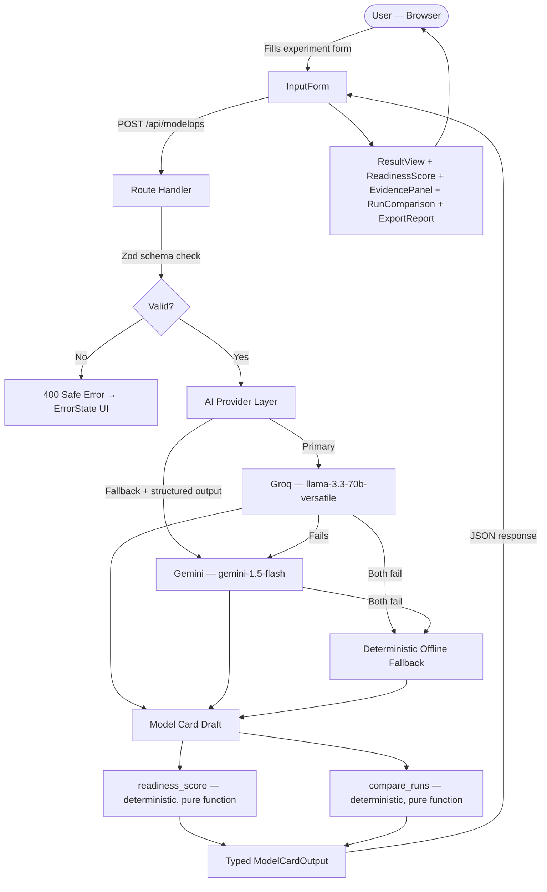

# ModelOps — System Architecture

> **Owner:** Ahmed Amir Rusrus — Integration Lead / Solution Architect
> **Last updated:** Session 5
> **Status:** COMPLETED — 100% Implemented & Verified

---

## 1. What This System Does

ModelOps is a lightweight ML governance workspace. A user submits experiment metadata (dataset, model, metrics) and the system:

1. Validates the input server-side before any AI is called
2. Uses AI to draft a model card strictly from the submitted evidence
3. Runs a deterministic readiness check to find gaps and assign a score (0–100)
4. Compares multiple runs side-by-side with deterministic metric diffs
5. Returns a structured result for human review — never auto-approved

**Non-negotiable rule:** The AI writes *from evidence only*. If evidence is missing, the gap is flagged. Nothing is invented.

---

## 2. Production Data Flow



---

## 3. Module Ownership

| Module | Owner | Boundary |
|--------|-------|----------|
| Architecture, contracts, integration, deployment | **Ahmed Amir Rusrus** | Everything that connects the parts. Reviews all PRs before merge. |
| API route, validation, AI providers, schema, service | **Moamen Elkholy** | Server-side only. No secret reaches the client. |
| UI pages, form, result render, export, ErrorBoundary, all 7 UI states | **Mohamed Said Mohamed Barakat** | Product UI & Workflow Engineer. Full frontend portal and interactive workflow. |
| Deterministic tools, knowledge corpus, eval cases | **Zein ElDin Mohamed Farouk** | `readiness_score()` and `compare_runs()` are pure functions — no AI logic inside them. |

**Dependency order:** Zein → Moamen → Mohamed → Ahmed → Production

---

## 4. Actual File Structure

```
ModelOps-main/
├── src/
│   ├── app/
│   │   ├── page.tsx                        # Root redirect to /modelops
│   │   ├── layout.tsx                      # App shell
│   │   ├── globals.css
│   │   ├── modelops/
│   │   │   └── page.tsx                    # Main 7-state workflow page & toolbar [Mohamed]
│   │   └── api/
│   │       └── modelops/
│   │           ├── route.ts                # POST /api/modelops [Moamen]
│   │           └── compare/
│   │               └── route.ts            # POST /api/modelops/compare [Moamen + Zein]
│   ├── components/
│   │   ├── modelops/
│   │   │   ├── InputForm.tsx               # Experiment intake form with inline validation [Mohamed]
│   │   │   ├── ResultView.tsx              # Structured model card render [Mohamed]
│   │   │   ├── ReadinessScore.tsx          # 0-100 score gauge & human review box [Mohamed]
│   │   │   ├── EvidencePanel.tsx           # Visually distinct tool trace & audit panel [Mohamed]
│   │   │   ├── RunComparison.tsx           # Side-by-side run diff & metric delta table [Mohamed]
│   │   │   ├── ExportReport.tsx            # PDF print, Markdown, and JSON exporter [Mohamed]
│   │   │   └── Skeletons.tsx               # Accessible pulse skeleton loading suite [Mohamed]
│   │   └── common/
│   │       ├── LoadingState.tsx            # Shared accessible loading spinner [Mohamed]
│   │       ├── ErrorState.tsx              # Shared accessible error alert box [Mohamed]
│   │       └── ErrorBoundary.tsx           # React render exception error boundary [Mohamed]
│   ├── lib/
│   │   ├── ai/
│   │   │   ├── groq.ts                     # Primary provider [Moamen]
│   │   │   ├── gemini.ts                   # Fallback + structured output [Moamen]
│   │   │   ├── prompts.ts                  # Prompt builder — anti-hallucination rules [Moamen]
│   │   │   ├── providers.ts                # Fallback orchestration [Moamen]
│   │   │   └── validators.ts               # AI response parser + Zod enforcement [Moamen]
│   │   ├── modelops/
│   │   │   ├── schema.ts                   # ModelCardOutput Zod schema [Moamen]
│   │   │   ├── service.ts                  # Request orchestrator + LRU cache [Moamen]
│   │   │   ├── validators.ts               # ExperimentMetadata input schema [Moamen]
│   │   │   ├── tools.ts                    # readiness_score() + compare_runs() [Zein]
│   │   │   ├── tool-rules.ts               # Scoring rules documentation [Zein]
│   │   │   ├── taxonomy.ts                 # Domain taxonomy [Zein]
│   │   │   └── lru.ts                      # LRU cache utility [Moamen]
│   │   ├── corpus/                         # Approved knowledge sources [Zein]
│   │   ├── env.ts                          # Server env var validation
│   │   ├── errors.ts                       # Error types
│   │   ├── logger.ts                       # Server-side logger (no secrets)
│   │   └── rate-limit.ts                   # Request rate limiting
│   └── types/
│       ├── index.ts                        # Shared TypeScript interfaces [All]
│       └── modelops.ts                     # Shared UI state & ModelCardOutput types [Mohamed]
├── tests/
│   ├── api/
│   │   ├── modelops.test.ts                # POST /api/modelops tests [Moamen]
│   │   └── compare.test.ts                 # POST /api/modelops/compare tests [Moamen + Zein]
│   ├── tools/                              # readiness_score() + compare_runs() tests [Zein]
│   ├── e2e/                                # Full journey tests [Ahmed]
│   ├── evaluation/                         # 10-case evaluation matrix [Zein]
│   └── fixtures/                           # Sample experiment records [Zein]
├── docs/
│   ├── architecture.md                     # This file [Ahmed]
│   ├── api-contracts.md                    # Route specs + schemas [Ahmed]
│   ├── release-checklist.md                # Production gate [Ahmed]
│   ├── ai-usage.md                         # AI usage log [All members]
│   ├── source-register.md                  # Approved trusted sources [Zein]
│   ├── model-card-template.md              # Required model card structure [Zein]
│   ├── readiness-checklist.md              # Human-readable scoring rubric [Zein]
│   └── known-gaps-and-limitations.md       # Known quality findings [Zein]
├── DEMO_SCRIPT.md                          # Live demo click path & defense Q&As [Mohamed]
├── CHANGELOG.md                            # Version history [Mohamed]
├── RELEASE_NOTES.md                        # Release notes [Mohamed]
├── .env.example                            # Variable names only — no values [Ahmed]
├── vercel.json                             # Vercel configuration
├── next.config.ts
├── package.json
└── README.md                               # [Ahmed]
```

---

## 5. API Surface

| Route | Method | Owner | Description |
|-------|--------|-------|-------------|
| `/api/modelops` | POST | Moamen | Validate input → AI draft → `readiness_score()` → return `ModelCardOutput` |
| `/api/modelops/compare` | POST | Moamen + Zein | Validate two runs → `compare_runs()` → return deterministic diff |

---

## 6. Shared Output Schema

Every AI response **must** conform to `ModelCardOutput` (defined in `src/lib/modelops/schema.ts` and `src/types/modelops.ts`).
`readiness_score` and `decision` are **never** set by the AI.

---

## 7. Session Gate Checkpoints

| Session | Architecture milestone | Status |
|---------|----------------------|:---:|
| **1** | Architecture agreed by all members; repo + branch rules active | COMPLETED |
| **2** | `docs/api-contracts.md` frozen — no contract changes without sign-off | COMPLETED |
| **3** | All modules running on `dev` end-to-end; no mocks in critical request path | COMPLETED |
| **4** | Production build clean on Vercel; env vars set in dashboard | COMPLETED |
| **5** | Every member presents and defends their module boundary | COMPLETED |
