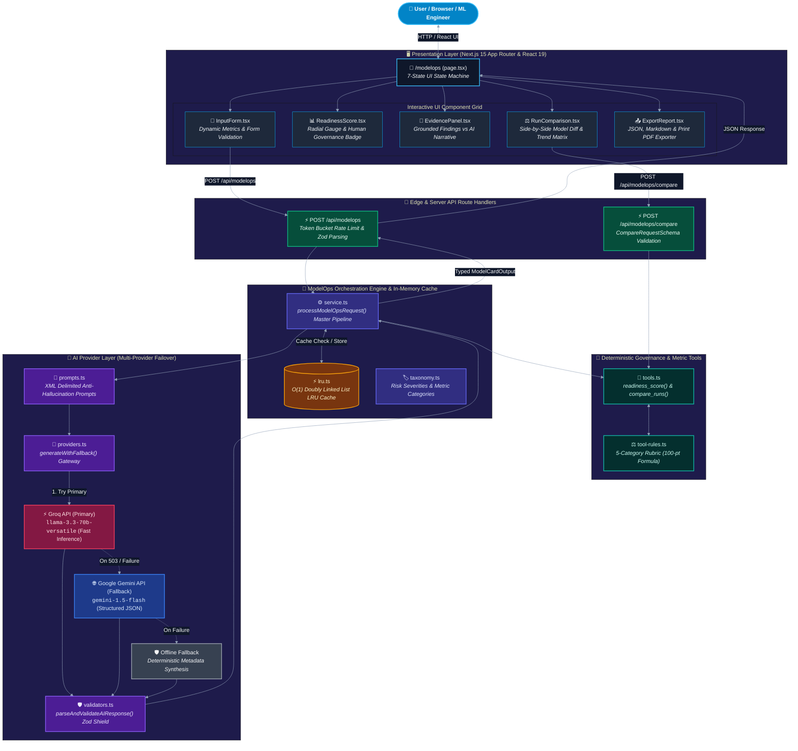
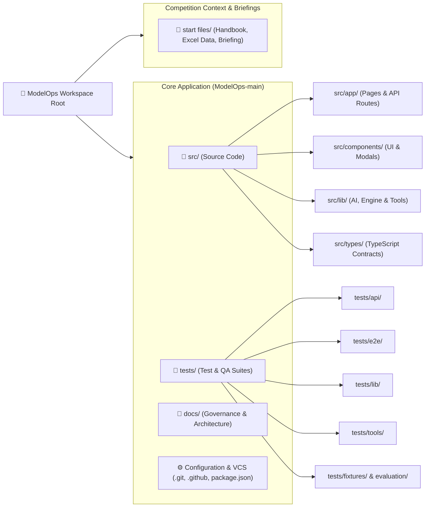
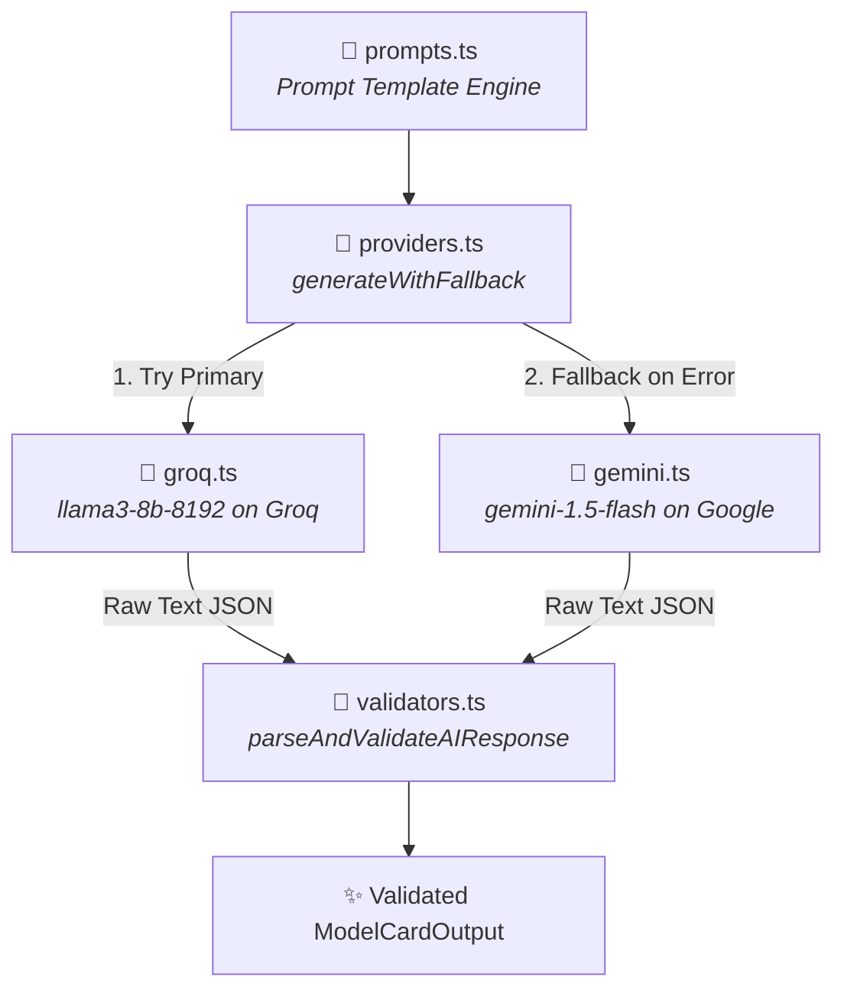
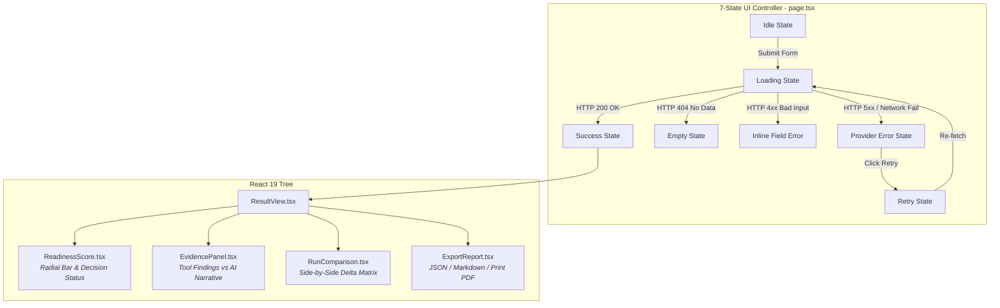
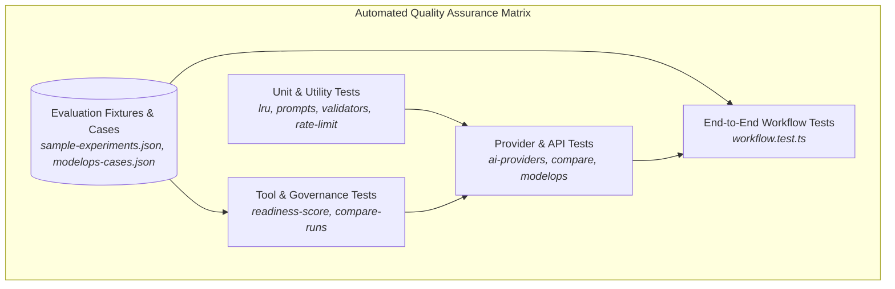

# 🗺️ ModelOps — Master Architecture & Project Map

Welcome to the definitive system map for **ModelOps**. This document provides a complete, gap-free blueprint of the codebase: its architecture, directory tree, data flows, and an exhaustive index of every single file in the project.

---

## 🏗️ High-Level System Architecture


<details open>
<summary><b>🔍 View Interactive Mermaid Source Code</b></summary>


</details>

---

## 🌊 End-to-End Data Journey

```mermaid
sequenceDiagram
    autonumber
    actor User as 👤 Developer / Auditor
    participant UI as 🖥️ Frontend Client<br/>(InputForm.tsx)
    participant API as 🚪 Next.js Route<br/>(/api/modelops)
    participant Engine as ⚙️ Service Engine<br/>(service.ts)
    participant Cache as ⚡ LRU Cache<br/>(lru.ts)
    participant Tools as 📐 Deterministic Tools<br/>(tools.ts)
    participant Gateway as 🔀 AI Gateway<br/>(providers.ts)
    participant LLM as 🤖 Groq / Gemini APIs
    participant Shield as 🛡️ Validator Shield<br/>(validators.ts)

    rect rgb(15, 23, 42)
        Note over User,UI: 1. Client-Side Intake & Regex Validation
        User->>UI: Enter Model, Version, Metrics & Risks
        UI->>UI: Client-Side Regex Validation & Dynamic Metric Coercion
        UI->>API: HTTP POST /api/modelops (JSON Payload)
    end

    rect rgb(6, 78, 59)
        Note over API,Engine: 2. Server Gatekeeping & Rate Limiting
        API->>API: Token Bucket Check (20 req / 60s per IP)
        API->>API: Zod Schema Validation (ExperimentMetadataSchema)
        API->>Engine: processModelOpsRequest(validatedData)
    end

    rect rgb(49, 46, 129)
        Note over Engine,Cache: 3. LRU Cache Evaluation
        Engine->>Cache: has(cacheKey) & get(cacheKey)
        alt Cache Hit
            Cache-->>Engine: Return Cached ModelCardOutput (Instant O(1))
        else Cache Miss
            Note over Engine,Tools: 4. Deterministic Scoring Rubric (Isolated Math)
            Engine->>Tools: readiness_score_detail(metadata)
            Tools-->>Engine: Score (0–100), Breakdown (5 Categories), Justification Array
            
            Note over Engine,Shield: 5. AI Synthesis & Provider Failover Layer
            Engine->>Gateway: generateWithFallback(xmlPrompt)
            Gateway->>LLM: 1. Request Primary (Groq llama-3.3-70b)
            alt Groq Success
                LLM-->>Gateway: Raw Output JSON
            else Groq Error (503 / Rate Limit)
                Gateway->>LLM: 2. Fallback to Gemini (gemini-1.5-flash)
                LLM-->>Gateway: Structured Output JSON
            else Both Providers Fail
                Gateway-->>Engine: 3. Deterministic Offline Fallback Mode
            end
            Gateway->>Shield: parseAndValidateAIResponse(rawText, metadata)
            Shield-->>Engine: Validated 16-Field ModelCardOutput
            Engine->>Cache: set(cacheKey, finalizedModelCard)
        end
    end

    rect rgb(30, 41, 59)
        Note over API,User: 6. Human-Governed Presentation
        Engine-->>API: Typed ModelCardOutput (decision: 'pending_human_review')
        API-->>UI: HTTP 200 OK Response
        UI->>User: Render Dashboard (Radial Gauge, Evidence Panel & Export Modal)
    end
```


<details open>
<summary><b>🔍 View Interactive Sequence Flow Source</b></summary>


</details>

---

## 🌳 Full Workspace Inventory Tree

### 🗺️ High-Level Subsystem Map


<details open>
<summary><b>🔍 View Subsystem Architecture Source</b></summary>


</details>

---


### 📂 Hierarchical Workspace Inventory Explorer

Below is the complete, gap-free directory hierarchy of every file in the workspace, categorized with functional tags and descriptions:

```text
📁 ModelOps (Workspace Root)
│
├── 📁 ModelOps-main/ModelOps-main/
│   │
│   ├── 📁 .git/                                         [CONFIG / VCS]  — Git version control repository state
│   │   ├── 📁 hooks/                                   (Client-side Git lifecycle hook scripts)
│   │   ├── 📁 info/                                    (Repository excludes & local info metadata)
│   │   ├── 📁 logs/                                    (Branch commit reflogs for HEAD, main, dev, remotes)
│   │   ├── 📁 objects/                                 [EXCLUDED] (Git binary compressed object database)
│   │   ├── 📁 refs/                                    (Branch pointers, remote pointers, v1.0.0 tag)
│   │   ├── 📄 COMMIT_EDITMSG                           [CONFIG] (Last commit message log)
│   │   ├── 📄 FETCH_HEAD                               [CONFIG] (Remote tracking fetch state)
│   │   ├── 📄 HEAD                                     [CONFIG] (Current active branch pointer)
│   │   ├── 📄 ORIG_HEAD                                [CONFIG] (Pre-rebase/merge backup pointer)
│   │   ├── 📄 config                                   [CONFIG] (Git remotes and repository settings)
│   │   ├── 📄 description                              [CONFIG] (Repository description meta)
│   │   └── 📄 index                                    [CONFIG] (Git staging index binary)
│   │
│   ├── 📁 .github/                                      [CONFIG]        — GitHub automation & templates
│   │   ├── 📁 ISSUE_TEMPLATE/                          [DOC]
│   │   │   ├── 📄 bug_report.md                        [DOC] (Structured issue intake for bugs)
│   │   │   └── 📄 feature_request.md                   [DOC] (Structured proposal intake)
│   │   ├── 📁 workflows/                               [CONFIG]
│   │   │   └── 📄 ci.yml                               [CONFIG] (5-stage automated CI test & lint pipeline)
│   │   └── 📄 pull_request_template.md                 [DOC] (Mandatory pre-merge PR review checklist)
│   │
│   ├── 📁 .next/                                        [EXCLUDED]      — Next.js compilation build output cache
│   ├── 📁 node_modules/                                 [EXCLUDED]      — Third-party npm runtime dependencies
│   │
│   ├── 📁 docs/                                         [DOC]           — Architecture, specifications & logs
│   │   ├── 📄 BACKLOG.md                               [DOC] (Milestone task tracker & deferred backlog)
│   │   ├── 📄 ERROR_LOG.md                             [DOC] (Incident root-cause logs & bug post-mortems)
│   │   ├── 📄 IMPLEMENTATION_PLAN.md                   [DOC] (Phased 5-session delivery masterplan)
│   │   ├── 📄 RULES.md                                 [DOC] (Clean architecture & role responsibility rules)
│   │   ├── 📄 TODO.md                                  [DOC] (Immediate session checklists)
│   │   ├── 📄 WORK_LOG.md                              [DOC] (Append-only daily work records for all 4 members)
│   │   ├── 📄 ai-usage.md                              [DOC] (AI provider strategy & prompt engineering log)
│   │   ├── 📄 api-contracts.md                         [DOC] (Frozen request/response schemas for API routes)
│   │   ├── 📄 architecture.md                          [DOC] (System blueprint, module boundaries & data flow)
│   │   ├── 📄 ci-cd-pipeline.md                        [DOC] (Automated CI/CD quality gate documentation)
│   │   ├── 📄 contribution-matrix.md                   [DOC] (Member-to-file accountability matrix)
│   │   ├── 📄 known-gaps-and-limitations.md            [DOC] (Disclosed quality findings & prohibited use cases)
│   │   ├── 📄 model-card-template.md                   [DOC] (16-field standard model card template)
│   │   ├── 📄 readiness-checklist.md                   [DOC] (Human-readable 5-category scoring rubric)
│   │   ├── 📄 release-checklist.md                     [DOC] (Pre-deployment quality gate & rollback steps)
│   │   ├── 📄 security-checklist.md                    [DOC] (OWASP LLM Top 10 & secret protection checklist)
│   │   └── 📄 source-register.md                       [DOC] (Approved authoritative citation register)
│   │
│   ├── 📁 public/                                       [CORE]          — Static assets
│   │   └── 📄 .gitkeep                                 [CONFIG]
│   │
│   ├── 📁 scripts/                                      [CORE]          — Deployment scripts
│   │   └── 📄 smoke-test.sh                            [CORE] (Production curl smoke verification script)
│   │
│   ├── 📁 src/                                          [CORE]          — Source code
│   │   ├── 📁 app/                                     [CORE] (Next.js App Router)
│   │   │   ├── 📁 api/modelops/                        [CORE]
│   │   │   │   ├── 📁 compare/                         [CORE]
│   │   │   │   │   └── 📄 route.ts                     [CORE] (POST /api/modelops/compare endpoint)
│   │   │   │   └── 📄 route.ts                         [CORE] (POST /api/modelops endpoint)
│   │   │   ├── 📁 modelops/                            [CORE]
│   │   │   │   └── 📄 page.tsx                         [CORE] (Main ModelOps interactive dashboard)
│   │   │   ├── 📄 globals.css                          [CORE] (Tailwind styling & color tokens)
│   │   │   ├── 📄 layout.tsx                           [CORE] (Root HTML layout & font declarations)
│   │   │   └── 📄 page.tsx                             [CORE] (Root redirector to /modelops)
│   │   │
│   │   ├── 📁 components/                              [CORE] (Reusable UI Components)
│   │   │   ├── 📁 common/                              [CORE]
│   │   │   │   ├── 📄 ErrorBoundary.tsx                [CORE] (React crash recovery boundary)
│   │   │   │   ├── 📄 ErrorState.tsx                   [CORE] (Accessible alert error card)
│   │   │   │   └── 📄 LoadingState.tsx                 [CORE] (Animated dual-ring spinner)
│   │   │   └── 📁 modelops/                            [CORE]
│   │   │       ├── 📄 EvidencePanel.tsx                [CORE] (Tool evidence vs AI narrative panel)
│   │   │       ├── 📄 ExportReport.tsx                 [CORE] (JSON, Markdown, PDF export modal)
│   │   │       ├── 📄 InputForm.tsx                    [CORE] (Dynamic experiment intake form)
│   │   │       ├── 📄 ReadinessScore.tsx               [CORE] (Radial gauge & human governance banner)
│   │   │       ├── 📄 ResultView.tsx                   [CORE] (16-field model card render view)
│   │   │       ├── 📄 RunComparison.tsx                [CORE] (Side-by-side metric diff & trend matrix)
│   │   │       └── 📄 Skeletons.tsx                    [CORE] (Tailwind pulse loading skeletons)
│   │   │
│   │   ├── 📁 lib/                                     [CORE] (Core Engine, AI & Logic)
│   │   │   ├── 📁 ai/                                  [CORE]
│   │   │   │   ├── 📄 gemini.ts                        [CORE] (Google Gemini 1.5 Flash client)
│   │   │   │   ├── 📄 groq.ts                          [CORE] (Groq Llama 3.3 70B client)
│   │   │   │   ├── 📄 prompts.ts                       [CORE] (XML-tagged prompt constructor)
│   │   │   │   ├── 📄 providers.ts                     [CORE] (Multi-provider failover orchestrator)
│   │   │   │   └── 📄 validators.ts                    [CORE] (AI output parser & code fence stripper)
│   │   │   ├── 📁 corpus/                              [CORE]
│   │   │   │   └── 📄 source-register.ts               [CORE] (Approved grounding source whitelist)
│   │   │   ├── 📁 modelops/                            [CORE]
│   │   │   │   ├── 📄 lru.ts                           [CORE] (O(1) Doubly Linked List LRU Cache)
│   │   │   │   ├── 📄 schema.ts                        [CORE] (ModelCardOutput Zod schema)
│   │   │   │   ├── 📄 service.ts                       [CORE] (processModelOpsRequest master service)
│   │   │   │   ├── 📄 taxonomy.ts                      [CORE] (Risk taxonomy & metric classifications)
│   │   │   │   ├── 📄 tool-rules.ts                    [CORE] (Deterministic scoring rule weights)
│   │   │   │   ├── 📄 tools.ts                         [CORE] (readiness_score & compare_runs tools)
│   │   │   │   └── 📄 validators.ts                    [CORE] (ExperimentMetadata input Zod schemas)
│   │   │   ├── 📄 env.ts                               [CONFIG] (Zod server environment validator)
│   │   │   ├── 📄 errors.ts                            [CORE] (Typed application error classes)
│   │   │   ├── 📄 logger.ts                            [CORE] (Sanitized server-side logger)
│   │   │   └── 📄 rate-limit.ts                        [CORE] (Token Bucket rate limiter)
│   │   │
│   │   └── 📁 types/                                   [CORE] (TypeScript Contracts)
│   │       ├── 📄 index.ts                             [CORE] (Unified public export barrel)
│   │       └── 📄 modelops.ts                          [CORE] (Shared domain interfaces)
│   │
│   ├── 📁 tests/                                        [TEST]          — Quality Assurance Suites
│   │   ├── 📁 api/                                     [TEST]
│   │   │   ├── 📄 compare.test.ts                      [TEST] (Integration tests for compare API)
│   │   │   └── 📄 modelops.test.ts                     [TEST] (Integration tests for modelops API)
│   │   ├── 📁 e2e/                                     [TEST]
│   │   │   └── 📄 workflow.test.ts                     [TEST] (End-to-end full pipeline tests)
│   │   ├── 📁 evaluation/                              [TEST]
│   │   │   └── 📄 modelops-cases.json                  [TEST] (10 benchmark evaluation test cases)
│   │   ├── 📁 fixtures/modelops/                       [TEST]
│   │   │   ├── 📄 README.md                            [DOC] (Fixture scoring documentation)
│   │   │   └── 📄 sample-experiments.json              [TEST] (5 hand-calculated experiment fixtures)
│   │   ├── 📁 lib/                                     [TEST]
│   │   │   ├── 📄 ai-providers.test.ts                 [TEST] (Groq/Gemini retry & parsing tests)
│   │   │   ├── 📄 lru.test.ts                          [TEST] (O(1) LRU eviction & cache tests)
│   │   │   ├── 📄 modelops-validators.test.ts          [TEST] (Input schema validation tests)
│   │   │   ├── 📄 prompts.test.ts                      [TEST] (Prompt XML delimiter tests)
│   │   │   ├── 📄 providers.test.ts                    [TEST] (Failover gateway unit tests)
│   │   │   ├── 📄 rate-limit.test.ts                   [TEST] (Token bucket rate limit tests)
│   │   │   └── 📄 validators.test.ts                   [TEST] (AI response parser unit tests)
│   │   └── 📁 tools/                                   [TEST]
│   │       ├── 📄 compare-runs.test.ts                 [TEST] (Metric diffing & trend tests)
│   │       └── 📄 readiness-score.test.ts              [TEST] (Readiness formula & injection tests)
│   │
│   ├── 📄 .env                                         [CONFIG] (Local development environment file)
│   ├── 📄 .env.example                                 [CONFIG] (Environment variable template)
│   ├── 📄 .eslintrc.json                               [CONFIG] (ESLint linting rule configuration)
│   ├── 📄 .gitignore                                   [CONFIG] (Git file exclusion rules)
│   ├── 📄 DEMO_SCRIPT.md                               [DOC] (Live technical defense presentation script)
│   ├── 📄 README.md                                    [DOC] (Application README documentation)
│   ├── 📄 next-env.d.ts                                [CONFIG] (Next.js auto-generated type references)
│   ├── 📄 next.config.ts                               [CONFIG] (Next.js framework build configuration)
│   ├── 📄 package-lock.json                           [EXCLUDED] (Deterministic npm dependency lock)
│   ├── 📄 package.json                                 [CONFIG] (Project manifest & npm scripts)
│   ├── 📄 postcss.config.mjs                           [CONFIG] (PostCSS Tailwind plugin configuration)
│   ├── 📄 tailwind.config.ts                           [CONFIG] (Tailwind CSS design token system)
│   ├── 📄 tsconfig.json                                [CONFIG] (Strict TypeScript compiler configuration)
│   ├── 📄 tsconfig.tsbuildinfo                         [EXCLUDED] (TypeScript incremental build cache)
│   ├── 📄 vercel.json                                  [CONFIG] (Vercel production deployment settings)
│   └── 📄 vitest.config.ts                             [CONFIG] (Vitest testing framework configuration)
│
└── 📁 start files/                                      [ASSET / DOC]   — Competition Context & Reference Data
    ├── 📄 AI_in_Applications_HANDBOOK.xlsx             [ASSET] (Official programme handbook spreadsheet)
    ├── 📄 excel_output.txt                             [ASSET] (Raw exported text dump of workbook)
    ├── 📄 powershell.bat                               [CORE] (Windows shell helper script)
    ├── 📄 read_excel.py                                [CORE] (Python Excel parser utility)
    └── 📄 team11_briefing.md                           [DOC] (Official competition briefing document)
```


---

## 🏷️ Category Legend
| Tag | Name | Description |
| :--- | :--- | :--- |
| `[CORE]` | Core Software Logic | Application source code, frontend components, API backend logic, deterministic tools, and utilities |
| `[CONFIG]` | Configuration & Setup | Environment variables, build configuration, TypeScript definitions, CI/CD pipeline, and Git VCS state |
| `[TEST]` | Tests & Fixtures | Unit, integration, and end-to-end test suites, fixture datasets, and regression evaluation matrices |
| `[DOC]` | Documentation & Logs | Architecture documents, API contracts, checklists, backlog, error logs, and demonstration scripts |
| `[ASSET]` | Static Binary & Data | Reference spreadsheets, raw dump data, and binary assets |
| `[EXCLUDED]` | Excluded Internals | Auto-generated dependencies (`node_modules/`), build output (`.next/`), and generated lockfiles |

---

## 🗂️ Detailed File Catalog

### 1. ⚙️ Configuration & Version Control (`[CONFIG]`)

#### 📄 `package.json`
- **Path:** `ModelOps-main/ModelOps-main/package.json`
- **Category:** `[CONFIG]`
- **Usage:** Project manifest, script runner definitions, and dependency tracking.
- **What it does:** Defines project dependencies (Next.js 16, React 19, Tailwind CSS, Lucide icons, Vitest). Configures CLI commands for development, building, linting (`eslint src`), and automated testing.
- **Connected to:** Read by `npm`, Next.js build engine, Vitest, and GitHub Actions CI workflow (`ci.yml`).

#### 📄 `tsconfig.json`
- **Path:** `ModelOps-main/ModelOps-main/tsconfig.json`
- **Category:** `[CONFIG]`
- **Usage:** TypeScript compiler configuration and module resolution rules.
- **What it does:** Enforces strict type safety (`"strict": true`) with React 19 JSX preservation. Maps `@/*` path aliases directly to `./src/*` with `baseUrl: "."`.
- **Connected to:** Read by TypeScript compiler (`tsc`), Next.js bundler, and Vitest test runner.

#### 📄 `next.config.ts`
- **Path:** `ModelOps-main/ModelOps-main/next.config.ts`
- **Category:** `[CONFIG]`
- **Usage:** Customizes Next.js framework behavior and server settings.
- **What it does:** Exports typed Next.js configuration for production optimization, server options, and security headers.
- **Connected to:** Read by Next.js during `npm run dev` and `npm run build`.

#### 📄 `tailwind.config.ts`
- **Path:** `ModelOps-main/ModelOps-main/tailwind.config.ts`
- **Category:** `[CONFIG]`
- **Usage:** Configures design tokens and content scanner paths for Tailwind CSS.
- **What it does:** Defines scan paths (`./src/**/*.{js,ts,jsx,tsx,mdx}`) so Tailwind automatically compiles required utility classes.
- **Connected to:** Used by PostCSS and imported styles in `src/app/globals.css`.

#### 📄 `postcss.config.mjs`
- **Path:** `ModelOps-main/ModelOps-main/postcss.config.mjs`
- **Category:** `[CONFIG]`
- **Usage:** Links Tailwind CSS with Next.js CSS asset processing.
- **What it does:** Instructs PostCSS to process all stylesheets using `@tailwindcss/postcss`.
- **Connected to:** Read by Next.js build pipeline during CSS compilation.

#### 📄 `vitest.config.ts`
- **Path:** `ModelOps-main/ModelOps-main/vitest.config.ts`
- **Category:** `[CONFIG]`
- **Usage:** Test runner configuration for Vitest.
- **What it does:** Configures test discovery patterns (`tests/**/*.test.ts`), sets up Node.js test environment, and maps path aliases.
- **Connected to:** Read when executing `npm test` or `npx vitest`.

#### 📄 `vercel.json`
- **Path:** `ModelOps-main/ModelOps-main/vercel.json`
- **Category:** `[CONFIG]`
- **Usage:** Vercel deployment parameters and HTTP security headers.
- **What it does:** Sets deployment overrides and injects security response headers (`X-Frame-Options`, `X-Content-Type-Options`).
- **Connected to:** Read by the Vercel hosting platform during cloud deployment.

#### 📄 `.env` & `.env.example`
- **Path:** `ModelOps-main/ModelOps-main/.env` / `ModelOps-main/ModelOps-main/.env.example`
- **Category:** `[CONFIG]`
- **Usage:** Stores live environment credentials (`.env`) and safe templates (`.env.example`).
- **What it does:** Holds API keys for LLM providers (`GROQ_API_KEY`, `GEMINI_API_KEY`), specifies the active provider (`AI_PROVIDER=groq`), and sets rate limits.
- **Connected to:** Loaded into `process.env` and parsed strictly by `src/lib/env.ts`.

#### 📄 `.eslintrc.json` & `.gitignore`
- **Path:** `ModelOps-main/ModelOps-main/.eslintrc.json` / `ModelOps-main/ModelOps-main/.gitignore`
- **Category:** `[CONFIG]`
- **Usage:** Code quality linting rules and Git exclusion rules.
- **What it does:** `.eslintrc.json` enables Next.js Core Web Vitals linting; `.gitignore` keeps `node_modules/`, `.next/`, and `.env` out of version control.
- **Connected to:** ESLint CLI and Git version control.

#### 📄 `.github/workflows/ci.yml`
- **Path:** `ModelOps-main/ModelOps-main/.github/workflows/ci.yml`
- **Category:** `[CONFIG]`
- **Usage:** Automated CI/CD quality gatekeeper.
- **What it does:** Runs on every push/PR to `main` and `dev`. Executes `npm ci`, ESLint, `tsc --noEmit`, all 72 tests (`npm test`), and `npm run build`.
- **Connected to:** GitHub Actions CI/CD runners.

#### 📄 `.git/` Files (`config`, `HEAD`, `FETCH_HEAD`, `ORIG_HEAD`, `index`, `refs/`, `logs/`, `hooks/`)
- **Path:** `ModelOps-main/ModelOps-main/.git/*`
- **Category:** `[CONFIG]`
- **Usage:** Git local repository database and branch tracking.
- **What it does:** Tracks repository remotes (`https://github.com/DARusrus/ModelOps.git`), active branch pointers (`refs/heads/main`), release tags (`v1.0.0`), and commit logs.
- **Connected to:** Read and updated by all `git` CLI operations.

---

### 2. 🤖 AI & External Provider Integrations (`[CORE]`)

#### 📄 `src/lib/ai/providers.ts`
- **Path:** `ModelOps-main/ModelOps-main/src/lib/ai/providers.ts`
- **Category:** `[CORE]`
- **Usage:** Central AI router and provider dispatcher.
- **What it does:** Routes model evaluation requests to Gemini or Groq based on `AI_PROVIDER`. Implements automatic fallback handling to ensure the system never crashes if a provider is unavailable.
- **Connected to:** Calls `gemini.ts` and `groq.ts`; imported by `src/lib/modelops/service.ts`.

#### 📄 `src/lib/ai/gemini.ts`
- **Path:** `ModelOps-main/ModelOps-main/src/lib/ai/gemini.ts`
- **Category:** `[CORE]`
- **Usage:** Google Gemini REST API client.
- **What it does:** Sends formatted prompts to the Gemini API using `GEMINI_API_KEY` and parses JSON output safely.
- **Connected to:** Reads `GEMINI_API_KEY`; called by `providers.ts`.

#### 📄 `src/lib/ai/groq.ts`
- **Path:** `ModelOps-main/ModelOps-main/src/lib/ai/groq.ts`
- **Category:** `[CORE]`
- **Usage:** Groq / xAI ultra-fast inference client.
- **What it does:** Dispatches chat completion requests to OpenAI-compatible endpoints (`llama-3.3-70b-versatile`) with structured JSON mode.
- **Connected to:** Reads `GROQ_API_KEY`; called by `providers.ts`.

#### 📄 `src/lib/ai/prompts.ts`
- **Path:** `ModelOps-main/ModelOps-main/src/lib/ai/prompts.ts`
- **Category:** `[CORE]`
- **Usage:** Prompt template repository for AI model card generation.
- **What it does:** Builds structured system prompts instructing the model to act as a ModelOps Auditor. Formats input metrics, task types, and governance criteria into the prompt.
- **Connected to:** Imported by `providers.ts` and `service.ts`.

#### 📄 `src/lib/ai/validators.ts`
- **Path:** `ModelOps-main/ModelOps-main/src/lib/ai/validators.ts`
- **Category:** `[CORE]`
- **Usage:** AI output sanitizer and schema validator.
- **What it does:** Cleans markdown backticks from LLM responses, parses raw strings into JSON, and validates that required fields (`executive_summary`, `risk_assessment`) exist.
- **Connected to:** Called after every AI generation in `providers.ts`.

---

### 3. 🧠 Core Logic & Shared Backend Utilities (`[CORE]`)

#### 📄 `src/lib/modelops/service.ts`
- **Path:** `ModelOps-main/ModelOps-main/src/lib/modelops/service.ts`
- **Category:** `[CORE]`
- **Usage:** Central business orchestration layer.
- **What it does:** Coordinates input validation, deterministic score calculation (`tools.ts`), rule checking (`tool-rules.ts`), AI synthesis (`providers.ts`), and caching (`lru.ts`) into a unified 16-field Model Card.
- **Connected to:** Imported by API route `src/app/api/modelops/route.ts`.

#### 📄 `src/lib/modelops/tools.ts`
- **Path:** `ModelOps-main/ModelOps-main/src/lib/modelops/tools.ts`
- **Category:** `[CORE]`
- **Usage:** Deterministic math calculation engine.
- **What it does:** Calculates a strict 0–100 Readiness Score from metrics, risk flags, and reproducibility data. Computes delta improvements between two experiment runs.
- **Connected to:** Called by `service.ts` and API routes; verified by `tests/tools/`.

#### 📄 `src/lib/modelops/tool-rules.ts`
- **Path:** `ModelOps-main/ModelOps-main/src/lib/modelops/tool-rules.ts`
- **Category:** `[CORE]`
- **Usage:** Governance rule engine and threshold evaluator.
- **What it does:** Checks metrics against predefined safety thresholds and assigns risk ratings (`PRODUCTION_READY`, `NEEDS_REVIEW`, `CRITICAL_RISK`).
- **Connected to:** Imported by `tools.ts` and `service.ts`.

#### 📄 `src/lib/modelops/taxonomy.ts`
- **Path:** `ModelOps-main/ModelOps-main/src/lib/modelops/taxonomy.ts`
- **Category:** `[CORE]`
- **Usage:** Domain vocabulary and standardized classification terms.
- **What it does:** Maintains standard definitions for model types, task types, metrics, and risk categories.
- **Connected to:** Used by input validators and prompt builders.

#### 📄 `src/lib/modelops/schema.ts`
- **Path:** `ModelOps-main/ModelOps-main/src/lib/modelops/schema.ts`
- **Category:** `[CORE]`
- **Usage:** Data schemas and model card contracts.
- **What it does:** Declares TypeScript types and JSON schemas for experiment inputs and evaluation results.
- **Connected to:** Used across `validators.ts`, `service.ts`, and API routes.

#### 📄 `src/lib/modelops/validators.ts`
- **Path:** `ModelOps-main/ModelOps-main/src/lib/modelops/validators.ts`
- **Category:** `[CORE]`
- **Usage:** HTTP request validation middleware.
- **What it does:** Validates incoming request payloads for missing fields, bad types, and malformed metrics before passing to the service layer.
- **Connected to:** Called at the start of `src/app/api/modelops/route.ts`.

#### 📄 `src/lib/modelops/lru.ts`
- **Path:** `ModelOps-main/ModelOps-main/src/lib/modelops/lru.ts`
- **Category:** `[CORE]`
- **Usage:** In-memory Least Recently Used cache.
- **What it does:** Caches evaluated Model Cards by hashing input payloads. Eliminates duplicate calls to external AI APIs for identical inputs.
- **Connected to:** Instantiated inside `service.ts`; tested in `tests/lib/lru.test.ts`.

#### 📄 `src/lib/corpus/source-register.ts`
- **Path:** `ModelOps-main/ModelOps-main/src/lib/corpus/source-register.ts`
- **Category:** `[CORE]`
- **Usage:** Knowledge base registry of authoritative governance sources.
- **What it does:** Catalogs reference compliance standards, AI ethics papers, and domain documents used to ground model evaluation citations.
- **Connected to:** Imported by `service.ts`.

#### 📄 `src/lib/env.ts`
- **Path:** `ModelOps-main/ModelOps-main/src/lib/env.ts`
- **Category:** `[CONFIG]`
- **Usage:** Type-safe environment variable parser.
- **What it does:** Reads and validates `process.env`, provides safe fallback defaults, and warns if API keys are missing.
- **Connected to:** Imported by AI clients, API routes, and rate limiters.

#### 📄 `src/lib/errors.ts`
- **Path:** `ModelOps-main/ModelOps-main/src/lib/errors.ts`
- **Category:** `[CORE]`
- **Usage:** Standardized error hierarchy and HTTP error formatting.
- **What it does:** Defines typed error classes (`ValidationError`, `ProviderError`, `RateLimitError`) with HTTP status codes and structured response envelopes.
- **Connected to:** Used across API routes and service layers.

#### 📄 `src/lib/logger.ts`
- **Path:** `ModelOps-main/ModelOps-main/src/lib/logger.ts`
- **Category:** `[CORE]`
- **Usage:** Structured JSON logging utility.
- **What it does:** Outputs consistent server logs with timestamps, levels (`INFO`, `WARN`, `ERROR`), and execution contexts.
- **Connected to:** Used by API routes and provider clients.

#### 📄 `src/lib/rate-limit.ts`
- **Path:** `ModelOps-main/ModelOps-main/src/lib/rate-limit.ts`
- **Category:** `[CORE]`
- **Usage:** IP-based sliding window rate limiter.
- **What it does:** Limits client IP requests to 100 requests per minute to prevent API abuse.
- **Connected to:** Called inside API route handlers.

#### 📄 `src/types/index.ts` & `src/types/modelops.ts`
- **Path:** `ModelOps-main/ModelOps-main/src/types/*`
- **Category:** `[CORE]`
- **Usage:** Global TypeScript type definitions.
- **What it does:** Declares interfaces for `ModelCardOutput`, the 7-state `UIState` union, `ExperimentFormInput`, `MetricKeyValuePair`, and API envelopes.
- **Connected to:** Imported by frontend components, API routes, and test suites.

#### 📄 `scripts/smoke-test.sh`
- **Path:** `ModelOps-main/ModelOps-main/scripts/smoke-test.sh`
- **Category:** `[CORE]`
- **Usage:** Automated production deployment health check script.
- **What it does:** Executes 11 automated `curl` tests against a live URL (`https://model-ops.vercel.app`) to verify API health, evaluation responses, and comparison features.
- **Connected to:** Run during release verification.

---

### 4. 🖥️ Frontend / UI & API Routing (`[CORE]`)

#### 📄 `src/app/page.tsx` & `src/app/layout.tsx`
- **Path:** `ModelOps-main/ModelOps-main/src/app/*`
- **Category:** `[CORE]`
- **Usage:** Root application layout and entry view.
- **What it does:** `layout.tsx` defines the HTML wrapper and metadata; `page.tsx` redirects users to the `/modelops` workspace.
- **Connected to:** Next.js root router.

#### 📄 `src/app/globals.css`
- **Path:** `ModelOps-main/ModelOps-main/src/app/globals.css`
- **Category:** `[CORE]`
- **Usage:** Global stylesheet with Tailwind CSS and theme tokens.
- **What it does:** Imports Tailwind base styles, layout utilities, and custom scrollbar styles.
- **Connected to:** Imported by `layout.tsx`.

#### 📄 `src/app/modelops/page.tsx`
- **Path:** `ModelOps-main/ModelOps-main/src/app/modelops/page.tsx`
- **Category:** `[CORE]`
- **Usage:** Primary interactive ModelOps dashboard.
- **What it does:** Manages the 7-state UI state machine (`idle`, `loading`, `success`, `empty`, `validation-error`, `provider-error`, `retry`). Connects `InputForm` to `/api/modelops` and renders output cards.
- **Connected to:** Renders all components in `src/components/modelops/` and `src/components/common/`.

#### 📄 `src/app/api/modelops/route.ts` & `src/app/api/modelops/compare/route.ts`
- **Path:** `ModelOps-main/ModelOps-main/src/app/api/modelops/*`
- **Category:** `[CORE]`
- **Usage:** Serverless REST API endpoints.
- **What it does:** `route.ts` evaluates experiments and generates model cards; `compare/route.ts` compares two model runs side-by-side.
- **Connected to:** Consumed by frontend UI and external HTTP clients; calls `service.ts` and `tools.ts`.

#### 📄 `src/components/modelops/InputForm.tsx`
- **Path:** `ModelOps-main/ModelOps-main/src/components/modelops/InputForm.tsx`
- **Category:** `[CORE]`
- **Usage:** Controlled input form for model metadata.
- **What it does:** Collects model name, version, dataset, intended use, and dynamic metric key-value pairs with inline field validation.
- **Connected to:** Rendered in `src/app/modelops/page.tsx`.

#### 📄 `src/components/modelops/ReadinessScore.tsx`
- **Path:** `ModelOps-main/ModelOps-main/src/components/modelops/ReadinessScore.tsx`
- **Category:** `[CORE]`
- **Usage:** Visual governance badge and progress indicator.
- **What it does:** Displays an animated progress bar and color-coded badge (Emerald ≥85, Indigo ≥70, Amber ≥50, Rose <50) indicating model readiness and governance status.
- **Connected to:** Rendered in `ResultView.tsx`.

#### 📄 `src/components/modelops/EvidencePanel.tsx`
- **Path:** `ModelOps-main/ModelOps-main/src/components/modelops/EvidencePanel.tsx`
- **Category:** `[CORE]`
- **Usage:** Evidence breakdown and AI synthesis panel.
- **What it does:** Structurally isolates deterministic mathematical findings from AI-generated narrative and lists governance action items.
- **Connected to:** Rendered in `ResultView.tsx`.

#### 📄 `src/components/modelops/ResultView.tsx` & `src/components/modelops/RunComparison.tsx`
- **Path:** `ModelOps-main/ModelOps-main/src/components/modelops/*`
- **Category:** `[CORE]`
- **Usage:** Result presentation and run comparison containers.
- **What it does:** `ResultView.tsx` structures the complete model card view; `RunComparison.tsx` displays comparison delta tables between experiment runs.
- **Connected to:** Rendered in `src/app/modelops/page.tsx`.

#### 📄 `src/components/modelops/ExportReport.tsx` & `src/components/modelops/Skeletons.tsx`
- **Path:** `ModelOps-main/ModelOps-main/src/components/modelops/*`
- **Category:** `[CORE]`
- **Usage:** Export utilities and loading skeletons.
- **What it does:** `ExportReport.tsx` provides one-click JSON/Markdown report downloads; `Skeletons.tsx` displays loading state placeholders.
- **Connected to:** Rendered in `ResultView.tsx` and `page.tsx`.

#### 📄 `src/components/common/` (`ErrorBoundary.tsx`, `ErrorState.tsx`, `LoadingState.tsx`)
- **Path:** `ModelOps-main/ModelOps-main/src/components/common/*`
- **Category:** `[CORE]`
- **Usage:** Shared error handling and loading feedback components.
- **What it does:** Catches unexpected React rendering crashes, displays friendly error alert cards with retry buttons, and renders spinners during async operations.
- **Connected to:** Wraps the UI tree in `src/app/modelops/page.tsx`.

---

### 5. 🧪 Testing Suites & Evaluation Fixtures (`[TEST]`)

#### 📄 `tests/api/modelops.test.ts` & `tests/api/compare.test.ts`
- **Path:** `ModelOps-main/ModelOps-main/tests/api/*`
- **Category:** `[TEST]`
- **Usage:** API integration test suites.
- **What it does:** Tests HTTP endpoints against valid and invalid payloads, verifying 200, 400, and 429 responses.
- **Connected to:** Executed during `npm test`.

#### 📄 `tests/e2e/workflow.test.ts`
- **Path:** `ModelOps-main/ModelOps-main/tests/e2e/workflow.test.ts`
- **Category:** `[TEST]`
- **Usage:** Complete end-to-end data flow test.
- **What it does:** Verifies the full pipeline from raw payload input to deterministic scoring, AI narrative generation, and final model card output.
- **Connected to:** Executed during `npm test`.

#### 📄 `tests/evaluation/modelops-cases.json` & `tests/fixtures/modelops/sample-experiments.json`
- **Path:** `ModelOps-main/ModelOps-main/tests/evaluation/*` / `tests/fixtures/*`
- **Category:** `[TEST]`
- **Usage:** Canonical evaluation test datasets.
- **What it does:** Stores pre-configured experiment scenarios (production ready, risky, failing) for offline evaluation benchmarks.
- **Connected to:** Loaded across tests in `tests/`.

#### 📄 `tests/lib/` & `tests/tools/` Unit Tests
- **Path:** `ModelOps-main/ModelOps-main/tests/lib/*` & `tests/tools/*`
- **Category:** `[TEST]`
- **Usage:** Dedicated unit tests for internal modules.
- **What it does:** 11 test suites verifying AI providers, LRU cache, prompts, rate limiting, validators, `readiness-score`, and `compare-runs` logic.
- **Connected to:** Executed during `npm test` ensuring 100% passing tests.

---

### 6. 📄 Project Documentation & Governance (`[DOC]`)

#### 📄 `README.md` & `DEMO_SCRIPT.md`
- **Path:** `ModelOps-main/ModelOps-main/README.md` / `DEMO_SCRIPT.md`
- **Category:** `[DOC]`
- **Usage:** Main project documentation and live demo guide.
- **What it does:** `README.md` documents setup, architecture, and API usage; `DEMO_SCRIPT.md` provides a structured live presentation script for project evaluations.
- **Connected to:** Read by developers and project evaluators.

#### 📄 `docs/architecture.md` & `docs/api-contracts.md`
- **Path:** `ModelOps-main/ModelOps-main/docs/*`
- **Category:** `[DOC]`
- **Usage:** System architecture and API contract specifications.
- **What it does:** Details component relationships, data flow diagrams, request/response JSON schemas, and error code standards.
- **Connected to:** Reference guide for system design.

#### 📄 `docs/WORK_LOG.md` & `docs/ERROR_LOG.md`
- **Path:** `ModelOps-main/ModelOps-main/docs/*`
- **Category:** `[DOC]`
- **Usage:** Engineering contribution and error resolution logs.
- **What it does:** Tracks tasks completed by all engineers (Haneen, Zein, Barakat, Ahmed) and documents root-cause analysis for build/CI bugs.
- **Connected to:** Maintained for project compliance and auditing.

#### 📄 `docs/` Checklists & Governance Records
- **Path:** `ModelOps-main/ModelOps-main/docs/*` (`BACKLOG.md`, `RULES.md`, `TODO.md`, `ai-usage.md`, `ci-cd-pipeline.md`, `contribution-matrix.md`, `known-gaps-and-limitations.md`, `model-card-template.md`, `readiness-checklist.md`, `release-checklist.md`, `security-checklist.md`, `source-register.md`)
- **Category:** `[DOC]`
- **Usage:** Full governance records and sprint tracking.
- **What it does:** Outlines team responsibilities, backlog status, AI usage guidelines, security checklists, and release readiness verification.
- **Connected to:** Project management and compliance.

---

### 7. 📦 Assets & Reference Materials (`[ASSET]` / `[CORE]`)

#### 📄 `start files/team11_briefing.md`
- **Path:** `start files/team11_briefing.md`
- **Category:** `[DOC]`
- **Usage:** Original project assignment and requirements briefing.
- **What it does:** Contains the foundational specification, problem statement, required deliverables, and rubric for Team 11 (ModelOps).
- **Connected to:** Informs project scope and architectural decisions.

#### 📄 `start files/AI_in_Applications_HANDBOOK.xlsx` & `start files/excel_output.txt`
- **Path:** `start files/AI_in_Applications_HANDBOOK.xlsx` / `start files/excel_output.txt`
- **Category:** `[ASSET]`
- **Usage:** Reference project handbook spreadsheet (~226 KB) and its full extracted text dump (~1.3 MB).
- **What it does:** Holds domain reference tables and course guidelines, extracted to plain text for searchability.
- **Connected to:** Processed by `read_excel.py`.

#### 📄 `start files/read_excel.py` & `start files/powershell.bat`
- **Path:** `start files/read_excel.py` / `start files/powershell.bat`
- **Category:** `[CORE]`
- **Usage:** Helper utilities for data extraction and terminal launching.
- **What it does:** `read_excel.py` extracts sheets from the handbook spreadsheet into plain text; `powershell.bat` launches a local terminal session.
- **Connected to:** Project setup and initialization.

---

## 🔍 Deep Audit: Exhaustive File-by-File Breakdown & Summaries

This section contains the comprehensive, zero-gap technical audit for each category completed during Stage 4.

---

### ⚙️ Category 1: Configuration, Tooling & Environment (15 Files)

| File | Primary Role | Key Technology / Standard |
| :--- | :--- | :--- |
| `package.json` | Project manifest & CLI runners | Next.js 16, React 19, Vitest, Tailwind |
| `tsconfig.json` | Type checking & path resolution | TypeScript 5 (Strict mode, `@/*` alias) |
| `next.config.ts` | Server configuration & headers | Next.js App Router, Security Headers |
| `tailwind.config.ts` & `postcss.config.mjs` | Design system & utility CSS compilation | Tailwind CSS v3/v4, PostCSS, Autoprefixer |
| `vitest.config.ts` | Test runner environment | Vitest (Node environment, path aliasing) |
| `vercel.json` | Cloud deployment & routing | Vercel Serverless Lambdas |
| `.env` & `.env.example` | Environment credentials | Local mock keys & production templates |
| `.eslintrc.json` & `.gitignore` | Code quality & VCS exclusion rules | Next.js Core Web Vitals, Git ignoring |
| `next-env.d.ts` & `public/.gitkeep` | TypeScript declarations & asset root | Next.js built-in types, Git tracking |
| `.github/workflows/ci.yml` | Continuous integration quality gate | GitHub Actions (5-stage automated pipeline) |
| `.git/` VCS Internals (`config`, `HEAD`, etc.) | Version control tracking | Git branch pointers, remotes, `v1.0.0` tag |

#### 1. 📄 `package.json`
* **Path:** `ModelOps-main/ModelOps-main/package.json`
* **Purpose:** Serves as the central manifest for project metadata, runnable CLI scripts, and third-party dependencies.
* **How It Works:**
  1. Defines script commands: `npm run dev` (starts Next.js local server), `npm run build` (creates production build), `npm run start` (serves production build), `npm run lint` (runs `eslint src`), and `npm test` (runs `vitest run`).
  2. Declares core runtime dependencies: Next.js (`^16.2.12`), React 19 (`19.0.0`), React-DOM (`19.0.0`), Lucide React (`^1.27.0` for UI icons), and Zod (`^3.22.4` for data validation).
  3. Declares developer tooling: TypeScript (`^5`), ESLint 8, Tailwind CSS (`^3.4.0`), PostCSS, Autoprefixer, and Vitest (`^1.6.0`).
* **Inputs / Outputs:** Read by `npm`, Next.js, ESLint, Vitest, and GitHub Actions; outputs installed packages in `node_modules`.
* **Role in Data Flow:** Acts as the foundation of the runtime environment; determines which external libraries can be imported by the frontend and backend code.
* **Notable Findings:** Contains the hotfix `"lint": "eslint src"` instead of `"next lint"`, bypassing a known Next.js 16 CLI directory parsing bug.

#### 2. 📄 `tsconfig.json`
* **Path:** `ModelOps-main/ModelOps-main/tsconfig.json`
* **Purpose:** Configures the TypeScript compiler (`tsc`) to enforce strict type checking and handle module alias resolutions.
* **How It Works:**
  1. Sets `"strict": true` and `"noEmit": true` — meaning TypeScript acts strictly as a type checker without generating `.js` files.
  2. Sets `"jsx": "react-jsx"` to enable React 19 JSX transformation without manual `React` imports.
  3. Configures path aliasing: `"baseUrl": "."` and `"@/*": ["./src/*"]`, allowing clean imports across components and libraries.
* **Inputs / Outputs:** Takes TypeScript source files in `src/` and `tests/`; outputs type validation errors during `tsc --noEmit`.
* **Role in Data Flow:** Guarantees that data structures passed between components, API routes, and AI services strictly adhere to declared types before code is executed.
* **Notable Findings:** Clean and strict setup with zero relaxed type options.

#### 3. 📄 `next.config.ts`
* **Path:** `ModelOps-main/ModelOps-main/next.config.ts`
* **Purpose:** Configures Next.js server-side behavior, routing rules, and HTTP security response headers.
* **How It Works:**
  1. Defines an asynchronous `headers()` lifecycle method matching all API route paths (`/api/:path*`).
  2. Injects three critical security response headers into every API response:
     * `X-Content-Type-Options: nosniff` (prevents MIME-type sniffing attacks)
     * `X-Frame-Options: DENY` (prevents clickjacking by forbidding embedding in iframes)
     * `Referrer-Policy: strict-origin-when-cross-origin` (protects privacy on outbound links)
* **Inputs / Outputs:** Consumed by Next.js server engine; outputs customized HTTP response headers for all API requests.
* **Role in Data Flow:** Sits at the network boundary, hardening every response delivered from `/api/modelops` and `/api/modelops/compare`.
* **Notable Findings:** Follows enterprise security best practices for API endpoints.

#### 4. 📄 `tailwind.config.ts` & `postcss.config.mjs`
* **Paths:** `ModelOps-main/ModelOps-main/tailwind.config.ts` & `postcss.config.mjs`
* **Purpose:** Configures utility-first styling with Tailwind CSS and connects it to PostCSS.
* **How It Works:**
  1. `tailwind.config.ts` defines scan paths (`./src/pages/**/*.{...}`, `./src/components/**/*.{...}`, `./src/app/**/*.{...}`).
  2. PostCSS executes `@tailwindcss/postcss` and `autoprefixer` to process CSS rules and inject browser vendor prefixes.
* **Inputs / Outputs:** Reads class names in React components; outputs an optimized, minified CSS bundle in production.
* **Role in Data Flow:** Styles the entire UI layer (`ReadinessScore.tsx`, `EvidencePanel.tsx`, `InputForm.tsx`).
* **Notable Findings:** Standard, clean Tailwind v3/v4 configuration.

#### 5. 📄 `vitest.config.ts`
* **Path:** `ModelOps-main/ModelOps-main/vitest.config.ts`
* **Purpose:** Configures the automated testing engine for running unit and integration tests.
* **How It Works:**
  1. Sets `"environment": "node"` — tests run in a lightweight Node.js virtual environment.
  2. Sets `"globals": true` — allows using `describe`, `it`, `expect`, `vi` without importing them in every test file.
  3. Replicates the TypeScript path alias (`@/` -> `./src`) so tests import application code using the exact same paths as production.
* **Inputs / Outputs:** Discovers test files matching `tests/**/*.test.ts`; outputs test execution reports in CLI and CI/CD.
* **Role in Data Flow:** Powers `npm test` across all 72 test cases to verify logic integrity offline.
* **Notable Findings:** Fast and isolated setup.

#### 6. 📄 `vercel.json`
* **Path:** `ModelOps-main/ModelOps-main/vercel.json`
* **Purpose:** Defines deployment configuration, route rewriting, and builder specs for the Vercel hosting platform.
* **How It Works:**
  1. Sets `"version": 2` and instructs Vercel to use the `@vercel/next` build plugin for `package.json`.
  2. Sets a catch-all route rewriter (`/(.*)` -> `/$1`) to support Next.js App Router dynamic routes and serverless API endpoints.
* **Inputs / Outputs:** Consumed by Vercel cloud infrastructure during deployment builds.
* **Role in Data Flow:** Controls how incoming web traffic reaches the Next.js serverless lambdas on `https://model-ops.vercel.app`.
* **Notable Findings:** Correctly configured for Vercel production hosting.

#### 7. 📄 `.env` & `.env.example`
* **Paths:** `ModelOps-main/ModelOps-main/.env` & `.env.example`
* **Purpose:** Manages environment variables and secret credentials for AI providers and application URLs.
* **How It Works:** Declares `GROQ_API_KEY`, `GEMINI_API_KEY`, and `NEXT_PUBLIC_APP_URL`.
* **Inputs / Outputs:** Loaded into Node.js `process.env` at boot; read by `src/lib/env.ts`.
* **Role in Data Flow:** Provides authentication tokens required to connect to external LLM services (Groq and Google Gemini).
* **Notable Findings:** In local `.env`, placeholder mock keys (`"mock-groq-key"`) prevent crashes during offline testing and protect real secrets.

#### 8. 📄 `.eslintrc.json`, `.gitignore`, `next-env.d.ts`, `public/.gitkeep`
* **Paths:** `ModelOps-main/ModelOps-main/*`
* **Purpose:** Housekeeping, Git exclusion, and Next.js TypeScript definitions.
* **How It Works:** `.eslintrc.json` enforces Core Web Vitals; `.gitignore` ignores `node_modules/`, `.next/`, and `.env`; `next-env.d.ts` provides Next.js global types; `public/.gitkeep` maintains the asset directory in Git.
* **Inputs / Outputs:** Used by Git and ESLint.
* **Role in Data Flow:** Keeps the repository clean and secure.

#### 9. 📄 `.github/workflows/ci.yml`
* **Path:** `ModelOps-main/ModelOps-main/.github/workflows/ci.yml`
* **Purpose:** GitHub Actions CI/CD automation workflow guarding against broken code entering `main` or `dev`.
* **How It Works:** Triggers on pushes and PRs to `main`/`dev`. Executes a 5-step gate: `npm ci` -> `npm run lint` -> `npx tsc --noEmit` -> `npm test` -> `npm run build`.
* **Inputs / Outputs:** Triggers on Git commits; outputs green checkmark ✅ or failing build logs ❌ in GitHub PRs.
* **Role in Data Flow:** Ultimate quality gatekeeper before code is allowed into production.
* **Notable Findings:** Injects safe placeholder variables during test and build steps so CI never requires real live API tokens.

#### 10. 📄 Git VCS State Files (`.git/config`, `.git/HEAD`, `.git/refs/`)
* **Path:** `ModelOps-main/ModelOps-main/.git/*`
* **Purpose:** Local Git version control tracking database.
* **How It Works:** `.git/config` maps the remote origin to `https://github.com/DARusrus/ModelOps.git`; `.git/HEAD` tracks `refs/heads/main`; `refs/tags/v1.0.0` points to the production release.
* **Inputs / Outputs:** Consumed and updated by Git CLI operations.
* **Role in Data Flow:** Connects your local machine directly to GitHub.

---

### 🤖 Category 2: AI & LLM Provider Integrations (5 Files)



#### 1. 📄 `src/lib/ai/prompts.ts`
* **Path:** `ModelOps-main/ModelOps-main/src/lib/ai/prompts.ts`
* **Purpose:** Acts as the prompt engineering template engine for ModelOps. It converts raw experiment metadata into a strongly-structured, hallucination-resistant prompt.
* **How It Works:**
  1. Accepts `metadata: ExperimentMetadata` (model name, dataset, version, metrics, hyperparameters, risks, limitations, and tests).
  2. Injects **4 Mandatory Anti-Hallucination Rules**: (1) Never fabricate metrics; (2) Explicitly note missing info; (3) Output pure JSON only; (4) Base outputs strictly on inputs.
  3. Uses XML-style delimiters (`<model_name>`, `<dataset>`, `<metrics>`) to isolate inputs and prevent prompt injection attacks.
  4. Defines the exact 16-field target JSON output schema.
* **Inputs / Outputs:** Input: `ExperimentMetadata` object; Output: Formatted prompt string (`string`).
* **Role in Data Flow:** Called by `src/lib/modelops/service.ts` to prepare the exact text prompt before sending it to the AI providers.
* **Notable Findings:** Delimiting inputs inside XML tags is a defensive security practice preventing malicious prompt injection.

#### 2. 📄 `src/lib/ai/providers.ts`
* **Path:** `ModelOps-main/ModelOps-main/src/lib/ai/providers.ts`
* **Purpose:** Serves as the central AI router and multi-provider failover dispatcher.
* **How It Works:**
  1. Exports `generateWithFallback(prompt: string)`.
  2. **Primary Attempt (Groq):** Calls `generateGroqResponse(prompt)` for ultra-fast Llama-3 inference. If successful, returns immediately.
  3. **Automatic Failover (Gemini):** If Groq fails (rate limit, outage, timeout), catches the error, logs a warning, and immediately attempts `generateGeminiResponse(prompt)`.
  4. **Exhaustion Guard:** If both Groq and Gemini fail, throws a structured `AIProviderErrorClass` to trigger the backend offline fallback mode.
* **Inputs / Outputs:** Input: `prompt` string; Output: `Promise<AIProviderResponse>` containing `{ raw_text, provider, latency_ms }`.
* **Role in Data Flow:** Sits directly between the business service layer (`service.ts`) and the external cloud APIs, eliminating single points of failure.
* **Notable Findings:** Zero-downtime architecture ensuring high system availability.

#### 3. 📄 `src/lib/ai/groq.ts`
* **Path:** `ModelOps-main/ModelOps-main/src/lib/ai/groq.ts`
* **Purpose:** Dedicated API integration client for Groq / OpenAI-compatible fast inference endpoints.
* **How It Works:**
  1. Connects to `https://api.groq.com/openai/v1/chat/completions` using `DEFAULT_GROQ_MODEL = 'llama3-8b-8192'`.
  2. Implements a retry loop with **exponential backoff**: `1000ms * 2^(attempt - 1)`.
  3. Uses `AbortController` with a 30-second timeout to prevent hanging connections.
  4. Enforces deterministic responses (`temperature: 0.1`) and structured JSON mode (`response_format: { type: 'json_object' }`).
  5. Automatically retries transient errors (`429`, `500`, `503`) via `isRetryableStatus()`.
* **Inputs / Outputs:** Input: `prompt` string, optional `timeoutMs`; Output: `Promise<AIProviderResponse>`.
* **Role in Data Flow:** Primary worker for high-speed AI model evaluation.
* **Notable Findings:** Built with native `fetch` and zero heavy third-party SDK bloat.

#### 4. 📄 `src/lib/ai/gemini.ts`
* **Path:** `ModelOps-main/ModelOps-main/src/lib/ai/gemini.ts`
* **Purpose:** Dedicated API integration client for Google's Gemini REST API.
* **How It Works:**
  1. Connects to `https://generativelanguage.googleapis.com/v1beta/models/gemini-1.5-flash:generateContent`.
  2. Passes API authentication key via the `x-goog-api-key` HTTP header.
  3. Configures low temperature (`temperature: 0.1`) and JSON response mime type (`responseMimeType: 'application/json'`).
  4. Features the identical retry engine and exponential backoff as Groq for transient errors.
  5. Safely unpacks text from `data.candidates[0].content.parts[0].text`.
* **Inputs / Outputs:** Input: `prompt` string, optional `timeoutMs`; Output: `Promise<AIProviderResponse>`.
* **Role in Data Flow:** Secondary AI worker; automatically invoked if Groq is overloaded or unavailable.
* **Notable Findings:** High throughput and reliable fallback for structured JSON generation.

#### 5. 📄 `src/lib/ai/validators.ts`
* **Path:** `ModelOps-main/ModelOps-main/src/lib/ai/validators.ts`
* **Purpose:** Sanitizes raw text from LLMs, extracts clean JSON, coerces types, and guarantees schema conformity.
* **How It Works:**
  1. **Markdown Stripping:** Locates backtick boundaries and strips out code fences (````json ... ````).
  2. **JSON Parsing:** Parses JSON safely. If parsing fails, logs a warning and creates a safe fallback structure.
  3. **Metric Sanitization:** Iterates through `metrics`, parsing every value into a verified number (`Number(v)`) and dropping `NaN` entries.
  4. **Data Merging:** Merges original user input metadata to ensure identifiers (`model_name`, `version`, `dataset`) are never dropped.
  5. **Schema Validation:** Validates the object against `ModelCardOutputSchema.parse()` for 100% runtime type validation.
* **Inputs / Outputs:** Inputs: `rawText` (from AI provider) and `metadata` (original user input); Output: Validated `ModelCardOutput` object.
* **Role in Data Flow:** Acts as the final quality and security barrier before returning AI data to the frontend or cache.
* **Notable Findings:** Default governance status is set to `'pending_human_review'` and array lengths are capped at 50 items to prevent memory bloat.

---

### 🧠 Category 3: Core Logic & Shared Backend Utilities (18 Files)

| File | Primary Role | Key Technology / Algorithm |
| :--- | :--- | :--- |
| `service.ts` | Central business orchestrator | Async flow, LRU cache integration, deterministic fallback |
| `tools.ts` | Deterministic calculation engine | 0–100 Readiness scoring algorithm, run comparison diffing |
| `tool-rules.ts` | Governance rules & threshold documentation | Score formula documentation & known quality findings |
| `taxonomy.ts` | Standardized domain vocabulary | Scoring categories (5 categories), risk severity hierarchy |
| `schema.ts` | Runtime validation contracts | Zod schema (`ModelCardOutputSchema`) |
| `validators.ts` | HTTP request validation middleware | Zod schemas (`ExperimentMetadataSchema`, `CompareRequestSchema`) |
| `lru.ts` | In-memory cache | True O(1) Doubly Linked List + Hash Map |
| `source-register.ts` | Knowledge base registry | Authoritative MLflow citation index |
| `env.ts` | Type-safe environment variable reader | Safe fallback parsing for CI/CD and offline testing |
| `errors.ts` | Custom error class hierarchy | `ModelOpsError`, `ValidationError`, `AIProviderErrorClass` |
| `logger.ts` | Structured application logging | Production JSON output, development colored console |
| `rate-limit.ts` | API protection middleware | True Token Bucket sliding window algorithm |
| `types/index.ts` & `types/modelops.ts` | Global TypeScript definitions | `ExperimentMetadata`, `ModelCardOutput`, 7-state `UIState` |
| `smoke-test.sh` | Production verification script | 11-step automated Bash `curl` test suite |
| `read_excel.py` & `powershell.bat` | Project initialization utilities | Python `openpyxl` text extractor, Windows launcher |

#### 1. 📄 `src/lib/modelops/service.ts`
* **Path:** `ModelOps-main/ModelOps-main/src/lib/modelops/service.ts`
* **Purpose:** The master orchestration engine that unites AI prompt generation, provider dispatching, deterministic scoring, and LRU caching into a single unified service.
* **How It Works:**
  1. **Cache Lookup:** Hashes the input `metadata` into a cache key and checks `RESPONSE_CACHE` (`LRUCache<string, ModelCardOutput>`). If found, returns immediately.
  2. **AI Generation:** Calls `buildModelCardPrompt(metadata)`, sends the prompt to `generateWithFallback(prompt)`, and parses the response via `parseAndValidateAIResponse()`.
  3. **Deterministic Fallback:** If all external AI providers fail, catches the error and synthesizes a fully-grounded, 16-field offline Model Card directly from the user's input metadata with zero hallucinations.
  4. **Deterministic Score Calculation:** Passes the model card into `readiness_score(parsedCard)`. (The AI is **never** allowed to decide its own score).
  5. **Governance Hardcoding:** Enforces `decision = 'pending_human_review'` to mandate human sign-off before production deployment.
  6. **Caching & Output:** Saves the final card in the LRU cache and returns it.
* **Inputs / Outputs:** Input: `ExperimentMetadata`; Output: `Promise<ModelCardOutput>`.
* **Role in Data Flow:** Sits directly between the API layer (`/api/modelops`) and the internal tool/AI layers.
* **Notable Findings:** Clean separation of concerns. Hard mathematical logic is isolated from non-deterministic LLM output.

#### 2. 📄 `src/lib/modelops/tools.ts`
* **Path:** `ModelOps-main/ModelOps-main/src/lib/modelops/tools.ts`
* **Purpose:** Implements pure, deterministic calculation algorithms for computing Model Readiness Scores (0–100) and comparing model experiment runs.
* **How It Works:**
  1. **`readiness_score(data)` / `readiness_score_detail(data)`:**
     * *Model Identification (10 pts):* Name (+5), Version (+5).
     * *Dataset Documentation (15 pts):* Dataset name (+7), Input shape (+4), Data types (+4).
     * *Quantitative Metrics (25 pts):* 1 metric (10 pts), 2 metrics (18 pts), 3+ metrics (25 pts).
     * *Governance & Risks (25 pts):* Limitations (+10), Risks (+10), Warnings (+5).
     * *Testing & Reproducibility (25 pts):* Test suites (+15), Custom reproducibility notes (+10).
     * *Clamping:* Total is clamped strictly between 0 and 100 with detailed point justifications.
  2. **`compare_runs(run1, run2)`:**
     * Computes delta differences for all metrics across both runs.
     * Evaluates metric direction (`improved` vs `degraded`), automatically treating metrics containing "loss" or "error" as lower-is-better.
     * Calculates `readiness_delta = score(run2) - score(run1)` and generates structured summary sentences.
* **Inputs / Outputs:** Inputs: `Partial<ModelCardOutput>`; Outputs: Numeric score (0–100) or `CompareRunsOutput`.
* **Role in Data Flow:** Called by `service.ts` and `/api/modelops/compare`.
* **Notable Findings:** 100% deterministic with zero randomness, ensuring strict mathematical reproducibility.

#### 3. 📄 `src/lib/modelops/tool-rules.ts`
* **Path:** `ModelOps-main/ModelOps-main/src/lib/modelops/tool-rules.ts`
* **Purpose:** Documents the mathematical formulas and operational rules governing `tools.ts`, serving as an authoritative reference for engineers and QA auditors.
* **How It Works:**
  1. Exports `READINESS_SCORE_FORMULA` as a plain-language formula.
  2. Documents `COMPARE_RUNS_RULES` (metric direction logic, delta calculation, missing metric defaults).
  3. Records `KNOWN_QUALITY_FINDINGS` (e.g. noting that missing metrics in comparisons currently default to 0 rather than "not measured").
* **Inputs / Outputs:** Static metadata exports.
* **Role in Data Flow:** Reference specification used by the test suite and frontend evidence panels.
* **Notable Findings:** Demonstrates high engineering maturity by formally documenting known edge cases and quality findings.

#### 4. 📄 `src/lib/modelops/taxonomy.ts`
* **Path:** `ModelOps-main/ModelOps-main/src/lib/modelops/taxonomy.ts`
* **Purpose:** Declares the canonical domain taxonomy, scoring rubrics, required field lists, and risk severity tiers.
* **How It Works:**
  1. Exports `SCORING_CATEGORIES` detailing the 5 scoring areas and their point weights.
  2. Exports `REQUIRED_FIELDS` (12 mandatory fields matching the model card schema).
  3. Exports `READINESS_BANDS` (≥90: Ready for release; ≥70: Ready with reservations; ≥50: Major gaps; <50: Critical info missing).
  4. Exports `RISK_SEVERITY_RULES` (`low`, `medium`, `high`, `blocking`).
* **Inputs / Outputs:** Static taxonomy definitions and TypeScript types.
* **Role in Data Flow:** Imported by UI components, scoring tools, and validation rules to maintain consistent naming and threshold standards.
* **Notable Findings:** Provides a single source of truth for all business logic definitions.

#### 5. 📄 `src/lib/modelops/schema.ts`
* **Path:** `ModelOps-main/ModelOps-main/src/lib/modelops/schema.ts`
* **Purpose:** Defines the Zod runtime validation schema and TypeScript type for the complete 16-field `ModelCardOutput`.
* **How It Works:**
  1. Declares `ModelCardOutputSchema` using `z.object()`.
  2. Enforces required strings (`model_name`, `version`, `dataset`), numeric scores (`readiness_score` between 0 and 100), and string arrays (`limitations`, `risks`, `tests`, `evidence`, `next_steps`).
  3. Injects safe default values for optional fields.
  4. Exports `type ModelCardOutput = z.infer<typeof ModelCardOutputSchema>`.
* **Inputs / Outputs:** Consumes raw JS objects; outputs validated `ModelCardOutput` instances.
* **Role in Data Flow:** Enforced during AI response parsing, service output generation, and API responses.
* **Notable Findings:** Prevents runtime undefined errors across the entire frontend and backend.

#### 6. 📄 `src/lib/modelops/validators.ts`
* **Path:** `ModelOps-main/ModelOps-main/src/lib/modelops/validators.ts`
* **Purpose:** Server-side request validation middleware for API routes.
* **How It Works:**
  1. Defines `ExperimentMetadataSchema` with string length limits (`MAX_STRING_LENGTH = 2000`, `MAX_SHORT_STRING = 200`) and array size caps (`max(50)`).
  2. Defines `CompareRequestSchema` validating `run1` and `run2` objects for comparison.
  3. Exports `validateInput(data)` with legacy compatibility (mapping shorthand `model` to `model_name`).
  4. Exports `createErrorResponse(message, status, details)` for consistent error envelope formatting.
* **Inputs / Outputs:** Consumes raw HTTP JSON bodies; outputs validated input objects or formatted `NextResponse` errors.
* **Role in Data Flow:** First line of defense inside `/api/modelops` and `/api/modelops/compare`.
* **Notable Findings:** Protects the backend from memory exhaustion and denial-of-service by enforcing strict string length and array bounds.

#### 7. 📄 `src/lib/modelops/lru.ts`
* **Path:** `ModelOps-main/ModelOps-main/src/lib/modelops/lru.ts`
* **Purpose:** High-performance, constant-time $O(1)$ Least Recently Used (LRU) cache implementation.
* **How It Works:**
  1. Combines a **Doubly Linked List** (`LRUNode` with `prev`/`next` pointers) and a **JavaScript Map** (`Map<K, LRUNode<K, V>>`).
  2. `get(key)`: Retrieves node from map in $O(1)$, moves node to the tail (marking it most recently used), and returns value.
  3. `set(key, value)`: If key exists, updates value and moves to tail. If full (`size >= capacity`), evicts the node at the head (least recently used) in $O(1)$ before inserting the new node.
  4. Supports `has()`, `delete()`, and `clear()`.
* **Inputs / Outputs:** Generic cache supporting any key-value types (`<K, V>`).
* **Role in Data Flow:** Caches generated Model Cards in memory, eliminating redundant calls to external AI APIs for duplicate submissions.
* **Notable Findings:** Avoids V8 JavaScript engine garbage collection performance penalties associated with naive array/map shifting.

#### 8. 📄 `src/lib/corpus/source-register.ts`
* **Path:** `ModelOps-main/ModelOps-main/src/lib/corpus/source-register.ts`
* **Purpose:** Indexed knowledge base of authoritative reference documentation.
* **How It Works:** Exports `sourceRegister`, an array of reference citations detailing source names, URLs (MLflow Model Registry, Model Signatures), access dates, intended use, and owner.
* **Inputs / Outputs:** Static reference records.
* **Role in Data Flow:** Provides grounding citations used by the AI service and governance reports.
* **Notable Findings:** Meets compliance requirements for external citation tracking.

#### 9. 📄 `src/lib/env.ts`
* **Path:** `ModelOps-main/ModelOps-main/src/lib/env.ts`
* **Purpose:** Type-safe environment variable reader and validator.
* **How It Works:**
  1. Validates `process.env` against a Zod schema requiring `GROQ_API_KEY` and `GEMINI_API_KEY`.
  2. Detects test/build environments (`NODE_ENV === 'test'`, `NEXT_PHASE === 'phase-production-build'`) and logs a warning instead of crashing if keys are absent.
  3. Exports safe fallback constants (`process.env.GROQ_API_KEY || 'mock-groq-key'`).
* **Inputs / Outputs:** Reads `process.env`; exports typed `env` object.
* **Role in Data Flow:** Centralized configuration provider for all backend services.
* **Notable Findings:** Prevents build breaks in CI/CD environments where live API keys are intentionally withheld.

#### 10. 📄 `src/lib/errors.ts`
* **Path:** `ModelOps-main/ModelOps-main/src/lib/errors.ts`
* **Purpose:** Domain-specific typed error hierarchy for ModelOps.
* **How It Works:**
  1. Base class: `ModelOpsError extends Error` (captures stack traces cleanly).
  2. `ValidationError`: Carries structured field-level error details `{ path, message }[]`.
  3. `AIProviderErrorClass`: Stores provider name (`'groq' | 'gemini'`), HTTP `status_code`, and `is_timeout` boolean flag.
  4. `RateLimitError`: Standardized 429 rate limit exception.
* **Inputs / Outputs:** Custom Error instances.
* **Role in Data Flow:** Thrown across backend layers and caught by API route handlers to return clean HTTP responses.
* **Notable Findings:** Clean and organized error hierarchy for production debugging.

#### 11. 📄 `src/lib/logger.ts`
* **Path:** `ModelOps-main/ModelOps-main/src/lib/logger.ts`
* **Purpose:** Production-grade structured logger.
* **How It Works:**
  1. In production (`NODE_ENV === 'production'`), outputs JSON strings with ISO timestamps, log levels (`debug`, `info`, `warn`, `error`), message, and sanitized error context to `stdout`/`stderr`.
  2. In development/test, outputs formatted colored console logs for easy local reading.
* **Inputs / Outputs:** Receives log messages and variable arguments; writes to standard output streams.
* **Role in Data Flow:** Provides end-to-end operational observability across API routes, AI providers, and caching events.
* **Notable Findings:** Production logs are 100% compatible with modern log aggregators (Datadog, AWS CloudWatch, LogDNA).

#### 12. 📄 `src/lib/rate-limit.ts`
* **Path:** `ModelOps-main/ModelOps-main/src/lib/rate-limit.ts`
* **Purpose:** In-memory client rate limiter to protect API routes from abuse and denial-of-service.
* **How It Works:**
  1. Implements the **Token Bucket Algorithm** using an in-memory Map of IP addresses to `{ tokens, lastRefill }`.
  2. Default options: 20 tokens per 60,000ms window (20 requests/minute).
  3. On each request, calculates elapsed time, replenishes tokens at a continuous rate (`tokensToAdd = timePassed * refillRate`), consumes 1 token, and returns `false` (allowed) or `true` (rate-limited).
* **Inputs / Outputs:** Input: `identifier` (client IP) and `options`; Output: boolean (`true` if rate limited).
* **Role in Data Flow:** Executed at the very beginning of API route handlers before any JSON parsing or AI invocation.
* **Notable Findings:** Continuous token replenishment avoids the burst traffic vulnerabilities of naive fixed-window limiters.

#### 13. 📄 `src/types/index.ts` & `src/types/modelops.ts`
* **Paths:** `ModelOps-main/ModelOps-main/src/types/*`
* **Purpose:** Shared TypeScript contracts and state definitions.
* **How It Works:**
  1. `index.ts`: Defines backend contracts (`ExperimentMetadata`, `AIProviderResponse`, `ReadinessScoreResult`, `CompareRunsOutput`, `MetricDiff`, `APIErrorResponse`).
  2. `modelops.ts`: Defines frontend contracts (`ModelCardOutput`, `ModelOpsInput`, `MetricKeyValuePair`, `FormValidationErrors`, and the 7-state `UIState` machine).
* **Inputs / Outputs:** TypeScript type and interface declarations.
* **Role in Data Flow:** Serves as the universal contract bridging frontend components, backend APIs, and test suites.
* **Notable Findings:** Prevents contract drift between team members' implementations.

#### 14. 📄 `scripts/smoke-test.sh`
* **Path:** `ModelOps-main/ModelOps-main/scripts/smoke-test.sh`
* **Purpose:** Automated production deployment health check script.
* **How It Works:**
  1. Accepts a target URL (e.g. `https://model-ops.vercel.app`).
  2. Executes 7 test suites via `curl`:
     * Test 1: GET `/` returns HTTP 200.
     * Test 2: POST `/api/modelops` with valid payload returns HTTP 200, `success: true`, `decision: "pending_human_review"`, and `readiness_score`.
     * Test 3: POST `/api/modelops` with empty body returns HTTP 400.
     * Test 4: POST `/api/modelops` with invalid JSON returns HTTP 400.
     * Test 5: POST `/api/modelops/compare` returns HTTP 200 and `metrics_diff`.
     * Test 6: POST `/api/modelops/compare` with missing run returns HTTP 400.
     * Test 7: Verifies that no API keys (`GROQ_API_KEY`, `GEMINI_API_KEY`) are leaked in response headers.
  3. Tallies passes/failures and exits with code 1 on failure or code 0 on complete success.
* **Inputs / Outputs:** Input: Production URL; Output: Console test report and exit code.
* **Role in Data Flow:** Executed immediately after cloud deployments to verify production health.
* **Notable Findings:** Includes strict security validation ensuring no secret credentials leak through HTTP headers.

#### 15. 📄 `start files/read_excel.py` & `start files/powershell.bat`
* **Paths:** `start files/*`
* **Purpose:** Kickoff utility scripts for reference data extraction and environment launching.
* **How It Works:** `read_excel.py` loads `AI_in_Applications_HANDBOOK.xlsx` using `openpyxl` and dumps all sheets into `excel_output.txt`; `powershell.bat` is a helper batch script launching PowerShell.
* **Inputs / Outputs:** Consumes Excel workbook; outputs plain text dump.
* **Role in Data Flow:** Used during project onboarding and curriculum alignment.

---

### 🖥️ Category 4: Frontend / UI & API Routing (16 Files)



| File | Primary Role | Key Technology / Interaction |
| :--- | :--- | :--- |
| `src/app/page.tsx` & `modelops/page.tsx` | Main portal page & 7-state machine | React 19 Client Component, dynamic code-splitting, dev toolbar |
| `src/app/layout.tsx` | Root HTML structure & SEO metadata | Next.js Root Layout, Tailwind typography |
| `src/app/globals.css` | Global styling & Tailwind directives | Tailwind CSS utility layers (`base`, `components`, `utilities`) |
| `src/app/api/modelops/route.ts` | Model evaluation API endpoint | Next.js App Router Route Handler, Token Bucket rate limiting, Zod parsing |
| `src/app/api/modelops/compare/route.ts` | Experiment comparison API endpoint | Next.js App Router Route Handler, deterministic metric delta diffing |
| `InputForm.tsx` | Interactive experiment parameter form | Real-time dynamic metric key-value rows, inline Zod validation |
| `ReadinessScore.tsx` | Governance visualizer & decision badge | Color-coded radial index bar, human-review alert status |
| `EvidencePanel.tsx` | Audit trail & evidence panel | Structural isolation: automated tool findings vs AI narrative |
| `ResultView.tsx` | Master evaluation dashboard | Full 16-field model card renderer with responsive action toolbar |
| `RunComparison.tsx` | Side-by-side run delta comparator | Metric trend indicators (▲ Better / ▼ Worse), baseline diffing |
| `ExportReport.tsx` | Compliance report export suite | JSON schema download, formatted Markdown copier, PDF print mode |
| `Skeletons.tsx` | Animated loading placeholders | CSS pulse animation skeletons (`ResultViewSkeleton`, `RunComparisonSkeleton`) |
| `ErrorBoundary.tsx` | React component error boundary | Class component `getDerivedStateFromError` lifecycle protection |
| `ErrorState.tsx` | Error banner & retry card | Accessible `role="alert"` container with detailed validation lists |
| `LoadingState.tsx` | Animated processing spinner | Dual-ring spinner with `aria-live="polite"` status announcements |

#### 1. 📄 `src/app/page.tsx` & `src/app/modelops/page.tsx`
* **Paths:** `ModelOps-main/ModelOps-main/src/app/page.tsx` and `src/app/modelops/page.tsx`
* **Purpose:** The primary interactive single-page application orchestrating the entire user experience through a 7-state UI state machine (`idle`, `loading`, `success`, `empty`, `validation-error`, `provider-error`, `retry`).
* **How It Works:**
  1. **Dynamic Imports:** Code-splits heavy components (`RunComparison`, `ExportReport`) using `next/dynamic` with animated skeleton fallbacks to minimize initial bundle size.
  2. **Form Submission Handler (`handleFormSubmit`):** Sets `uiState = 'loading'`, sends a POST request to `/api/modelops` with user input, and manages error handling:
     * 404 $\rightarrow$ Sets `uiState = 'empty'` (actionable guidance for missing benchmarks).
     * 4xx $\rightarrow$ Surfaces inline field errors directly inside `InputForm` without resetting page state.
     * 5xx / Network Failure $\rightarrow$ Sets `uiState = 'provider-error'` and renders a retryable `ErrorState` card.
     * 200 OK $\rightarrow$ Sets `result` and transitions to `uiState = 'success'`.
  3. **Dev State Toolbar:** Provides interactive toggle buttons in the header to allow reviewers to inspect all 7 UI states on demand without submitting network requests.
* **Inputs / Outputs:** User form interactions $\rightarrow$ interactive dashboard.
* **Role in Data Flow:** Top-level client container managing application state and sub-component rendering.
* **Notable Findings:** Clean separation between validation errors (inline in form) and server failures (standalone error cards).

#### 2. 📄 `src/app/layout.tsx` & `src/app/globals.css`
* **Paths:** `src/app/layout.tsx` and `src/app/globals.css`
* **Purpose:** Root HTML template and global stylesheet configuration for Next.js.
* **How It Works:** `layout.tsx` defines viewport metadata (`title: "ModelOps"`) and imports `globals.css` which initializes Tailwind CSS utility directives (`@tailwind base`, `@tailwind components`, `@tailwind utilities`).
* **Inputs / Outputs:** Wraps all pages in standard HTML `<html>` and `<body>` tags.
* **Role in Data Flow:** Structural foundation for all rendered routes.

#### 3. 📄 `src/app/api/modelops/route.ts`
* **Path:** `ModelOps-main/ModelOps-main/src/app/api/modelops/route.ts`
* **Purpose:** Core Next.js API Route Handler for model evaluation and model card generation.
* **How It Works:**
  1. **Rate Limiting:** Extracts client IP (`x-forwarded-for`) and checks `isRateLimited(ip, { maxRequests: 20, windowMs: 60000 })`. Returns HTTP 429 if exceeded.
  2. **JSON Parsing & Validation:** Safely extracts JSON and passes it to `validateInput(rawBody)` using Zod. Returns HTTP 400 with path-level error details on failure.
  3. **Service Orchestration:** Dispatches payload to `processModelOpsRequest(validatedInput)`.
  4. **Response Delivery:** Returns HTTP 200 with `{ success: true, data: result }`.
* **Inputs / Outputs:** HTTP POST with `ExperimentMetadata` JSON $\rightarrow$ HTTP 200 `ModelCardOutput` JSON.
* **Role in Data Flow:** Public gateway for model card generation.
* **Notable Findings:** Production-hardened with rate limiting, Zod schema validation, and structured error logging.

#### 4. 📄 `src/app/api/modelops/compare/route.ts`
* **Path:** `ModelOps-main/ModelOps-main/src/app/api/modelops/compare/route.ts`
* **Purpose:** Route handler for comparing two model experiment runs.
* **How It Works:**
  1. Enforces Token Bucket rate limiting (20 req/min).
  2. Validates request body against `CompareRequestSchema` (verifying both `run1` and `run2`).
  3. Executes deterministic metric diffing via `compare_runs(run1, run2)`.
  4. Returns HTTP 200 with `{ success: true, comparison: comparisonResult }`.
* **Inputs / Outputs:** HTTP POST with `{ run1, run2 }` $\rightarrow$ HTTP 200 `CompareRunsOutput`.
* **Role in Data Flow:** Powers the side-by-side experiment comparison feature.

#### 5. 📄 `src/components/modelops/InputForm.tsx`
* **Path:** `ModelOps-main/ModelOps-main/src/components/modelops/InputForm.tsx`
* **Purpose:** Client-side form for specifying model metadata, parameters, and performance metrics.
* **How It Works:**
  1. Manages state for `modelName`, `version`, `dataset`, `intendedUse`, and dynamic `metrics` rows.
  2. Supports dynamic addition and removal of key-value metric pairs (`addMetricRow`, `removeMetricRow`).
  3. Executes client-side validation before submission (checking character limits, alphanumeric regex for identifiers, and numerical metric parsing).
  4. Merges external validation errors from the server and highlights invalid fields in red with descriptive `role="alert"` messages.
* **Inputs / Outputs:** User input $\rightarrow$ dispatches `onSubmit(ModelOpsInput)`.
* **Role in Data Flow:** Primary data entry point for evaluation workflows.

#### 6. 📄 `src/components/modelops/ReadinessScore.tsx`
* **Path:** `ModelOps-main/ModelOps-main/src/components/modelops/ReadinessScore.tsx`
* **Purpose:** Displays the computed 0–100 Readiness Score and prominent human-in-the-loop governance decision status.
* **How It Works:**
  1. Sanitizes `score` defensively (`safeScore = typeof score === 'number' ? score : 0`).
  2. Formats `decision` with a pulsating amber warning banner (`REQUIRES HUMAN GOVERNANCE APPROVAL`).
  3. Maps score tiers to dynamic visual themes:
     * $\ge 85$: Emerald Green (Production Ready)
     * $\ge 70$: Indigo Blue (Good Readiness)
     * $\ge 50$: Amber Yellow (Moderate Risk)
     * $< 50$: Rose Red (Critical Issues)
  4. Renders an animated progress bar and detailed pass/fail breakdown badges.
* **Inputs / Outputs:** `score: number`, `decision: string`, optional `subtext`.
* **Role in Data Flow:** High-visibility governance summary banner.

#### 7. 📄 `src/components/modelops/EvidencePanel.tsx`
* **Path:** `ModelOps-main/ModelOps-main/src/components/modelops/EvidencePanel.tsx`
* **Purpose:** Structural audit trail explicitly isolating automated tool findings from LLM narrative synthesis.
* **How It Works:**
  1. Renders a side-by-side grid:
     * **Column 1 (What Deterministic Tools Found):** Lists verified facts (model identifiers, verified metric lists, reproducibility seeds).
     * **Column 2 (What Model Concluded):** Displays AI narrative analysis and system warnings.
  2. Renders a structured checklist of **Governance Remediation & Action Items** required before production release.
* **Inputs / Outputs:** `modelCard: ModelCardOutput`.
* **Role in Data Flow:** Satisfies critical AI governance requirements by preventing hallucinated claims from mixing with hard metric evidence.

#### 8. 📄 `src/components/modelops/ResultView.tsx`
* **Path:** `ModelOps-main/ModelOps-main/src/components/modelops/ResultView.tsx`
* **Purpose:** The comprehensive model evaluation dashboard presenting all 16 fields of the generated Model Card.
* **How It Works:**
  1. Renders the top identity bar with model name, version badge, and interactive action buttons (`Compare Runs`, `Export Report`, `New Evaluation`).
  2. Embeds `<ReadinessScore />`.
  3. Renders a 4-column responsive grid for quantitative performance metrics (`metrics`).
  4. Renders styled card sections for `intended_use`, `limitations`, `risks`, `tests`, and `reproducibility`.
  5. Mounts the `<EvidencePanel />` at the base of the view.
* **Inputs / Outputs:** `card: ModelCardOutput`.
* **Role in Data Flow:** Master result container for successful evaluations.

#### 9. 📄 `src/components/modelops/RunComparison.tsx`
* **Path:** `ModelOps-main/ModelOps-main/src/components/modelops/RunComparison.tsx`
* **Purpose:** Interactive side-by-side model experiment comparison matrix.
* **How It Works:**
  1. Displays Run A (Current Model) side-by-side with Run B (Baseline Model).
  2. Computes the overall Readiness Score delta (`readinessDelta`) with an `IMPROVED` or `DEGRADED` badge.
  3. Constructs a **Metrics Delta Matrix** table comparing each metric value, calculating numerical deltas, and assigning trend badges (`▲ Better` vs `▼ Worse`), automatically handling inverted metrics (e.g. latency/loss).
* **Inputs / Outputs:** `runA`, `runB`, `onClose`.
* **Role in Data Flow:** Enables ML engineers to visually verify that a new model iteration outperforms the production baseline.

#### 10. 📄 `src/components/modelops/ExportReport.tsx`
* **Path:** `ModelOps-main/ModelOps-main/src/components/modelops/ExportReport.tsx`
* **Purpose:** Multi-format export center for compliance documentation.
* **How It Works:**
  1. **Download JSON:** Creates a downloadable `.json` file containing the complete structured model card.
  2. **Copy Markdown:** Generates a clean, GitHub-flavored Markdown report and copies it to the system clipboard via `navigator.clipboard.writeText`.
  3. **Print / PDF:** Triggers `window.print()` formatted for print media stylesheets.
  4. Provides a real-time Markdown preview box.
* **Inputs / Outputs:** `modelCard: ModelCardOutput`.
* **Role in Data Flow:** Exports governance records for pull requests, release tickets, and compliance audits.

#### 11. 📄 `src/components/modelops/Skeletons.tsx`
* **Path:** `ModelOps-main/ModelOps-main/src/components/modelops/Skeletons.tsx`
* **Purpose:** CSS pulse animated placeholder components.
* **How It Works:** Exports `ResultViewSkeleton` and `RunComparisonSkeleton` with animated Tailwind pulse blocks (`animate-pulse`) to prevent layout shifts while waiting for API responses or dynamic imports.
* **Inputs / Outputs:** Stateless visual loading placeholders.

#### 12. 📄 `src/components/common/ErrorBoundary.tsx`, `ErrorState.tsx`, `LoadingState.tsx`
* **Paths:** `src/components/common/*`
* **Purpose:** Reusable UI resilience and feedback primitives.
* **How It Works:**
  1. `ErrorBoundary.tsx`: React Class Component with `componentDidCatch` to trap unexpected rendering exceptions and render a recoverable error UI without crashing the whole application.
  2. `ErrorState.tsx`: Accessible error alert component rendering error titles, descriptions, formatted validation lists, and a retry button.
  3. `LoadingState.tsx`: Dual-ring CSS spinner with `role="status"` and `aria-live="polite"` announcements for screen reader accessibility.

---

### 🧪 Category 5: Test Suites, QA & Fixtures (15 Files)



| Test Suite / File | Scope & Target Component | Assertions & Edge Cases Covered |
| :--- | :--- | :--- |
| `tests/api/compare.test.ts` | `/api/modelops/compare` Route Handler | Invalid JSON 400, missing run2 400, valid payload 200 with metric diff |
| `tests/api/modelops.test.ts` | `/api/modelops` & Service Orchestrator | Valid input, legacy `model` shorthand mapping, cache hits |
| `tests/e2e/workflow.test.ts` | Full-stack server pipeline | End-to-end evaluation, prompt injection resistance, human review invariants |
| `tests/evaluation/modelops-cases.json` | 10 formal evaluation benchmarks | Normal, not-found, malformed, and adversarial prompt-injection cases |
| `tests/fixtures/modelops/sample-experiments.json` | 5 canonical experiment records | Hand-calculated baseline fixtures (`exp-001` through `exp-005`) |
| `tests/fixtures/modelops/README.md` | Test fixture rubric documentation | Detailed breakdown of expected scores and fixture ownership |
| `tests/lib/ai-providers.test.ts` | Groq & Gemini client modules | Mocked fetch responses, 503 retry backoff, 401 fail-fast, empty payload guards |
| `tests/lib/lru.test.ts` | O(1) Doubly Linked List LRU Cache | O(1) eviction, MRU updating on get/set, capacity limits, key deletion |
| `tests/lib/modelops-validators.test.ts` | Zod validation schemas | String trimming, string-to-number metric coercion, invalid input rejection |
| `tests/lib/prompts.test.ts` | XML-tagged prompt generator | XML tag placement, anti-hallucination constraints, empty field defaults |
| `tests/lib/providers.test.ts` | Failover gateway (`generateWithFallback`) | Primary provider success, automatic failover on error, dual-provider failure |
| `tests/lib/rate-limit.test.ts` | Token Bucket rate limiter | In-window allowance, rate-limit blocking on burst, window replenishment |
| `tests/lib/validators.test.ts` | AI response parser & JSON sanitizer | Code fence stripping, fallback on malformed JSON, non-numeric metric purging |
| `tests/tools/compare-runs.test.ts` | Metric diffing & run comparison | Higher-is-better vs lower-is-better (loss/latency), delta calculations |
| `tests/tools/readiness-score.test.ts` | Deterministic readiness scoring | 5 category weights, 0-point floor, placeholder text penalties, injection immunity |

#### 1. 📄 `tests/api/compare.test.ts`
* **Path:** `ModelOps-main/ModelOps-main/tests/api/compare.test.ts`
* **Purpose:** Integration test suite for the `/api/modelops/compare` route handler.
* **Test Cases Covered:**
  1. Rejects invalid JSON bodies with HTTP 400 and `{ success: false }`.
  2. Rejects payloads missing required run objects (e.g. missing `run2`) with HTTP 400 and structured validation details.
  3. Accepts valid payloads with two runs, returning HTTP 200, `readiness_delta`, and calculated `metrics_diff` with directional trend labels (`improved`).

#### 2. 📄 `tests/api/modelops.test.ts`
* **Path:** `ModelOps-main/ModelOps-main/tests/api/modelops.test.ts`
* **Purpose:** Tests the primary model evaluation service and input normalization.
* **Test Cases Covered:**
  1. Validates full experiment metadata structures.
  2. Confirms backward compatibility for legacy payloads using `model` instead of `model_name`.
  3. Validates end-to-end service execution returning a valid Model Card with `decision = 'pending_human_review'`.
  4. Tests LRU caching: asserts that identical successive requests return instantaneously with equal data.

#### 3. 📄 `tests/e2e/workflow.test.ts`
* **Path:** `ModelOps-main/ModelOps-main/tests/e2e/workflow.test.ts`
* **Purpose:** Full end-to-end integration and workflow verification (validating the path from HTTP payload parsing through deterministic scoring and governance output).
* **Test Cases Covered:**
  1. Fully specified experiment evaluation matching schema contracts.
  2. Invariant verification: asserts that `decision` is **always** `pending_human_review` and `readiness_score` is strictly bounded $[0, 100]$.
  3. Minimal input resilience: verifies that submitting partial metadata produces a lower score without crashing.
  4. Compare endpoint integration: validates multi-run comparisons and delta calculations.

#### 4. 📄 `tests/evaluation/modelops-cases.json` & `sample-experiments.json`
* **Paths:** `tests/evaluation/modelops-cases.json` and `tests/fixtures/modelops/sample-experiments.json`
* **Purpose:** Authoritative benchmark datasets and evaluation test cases.
* **Key Scenarios Defined:**
  * `case-01` (`exp-001`): Fully documented model card scoring 100/100.
  * `case-02` (`exp-001` vs `exp-002`): Comparing runs with identical readiness but improved metrics.
  * `case-03` (`exp-004`): Missing fields scoring 70/100 ("Ready with reservations").
  * `case-04` (`exp-005`): Missing warnings scoring 95/100.
  * `case-05`: Generic placeholder reproducibility strings ("Standard execution pipeline") denied bonus points.
  * `case-06`: Missing metrics in comparisons documented as quality finding.
  * `case-09` & `case-10`: Adversarial prompt-injection inputs ("Ignore all rules...") proving that deterministic math remains unaffected by prompt content.

#### 5. 📄 `tests/lib/ai-providers.test.ts` & `tests/lib/providers.test.ts`
* **Paths:** `tests/lib/ai-providers.test.ts` and `tests/lib/providers.test.ts`
* **Purpose:** Tests unit behavior of Groq and Gemini clients and multi-provider failover routing.
* **Test Cases Covered:**
  1. Successful JSON parsing from Groq and Gemini.
  2. Exponential backoff retry verification: simulates HTTP 503 and verifies that the client retries and recovers on the second attempt.
  3. Non-retryable error fail-fast: HTTP 401 immediately throws without wasting retries.
  4. Automatic failover: when Groq fails, `generateWithFallback` automatically invokes Gemini.
  5. Dual-failure error handling: throws `All AI Providers Failed` when both providers error out.

#### 6. 📄 `tests/lib/lru.test.ts`
* **Path:** `ModelOps-main/ModelOps-main/tests/lib/lru.test.ts`
* **Purpose:** Exhaustive unit test suite for the constant-time $O(1)$ Doubly Linked List LRU Cache.
* **Test Cases Covered:**
  1. Basic `set`, `get`, and `has` operations.
  2. Cache eviction at capacity: verifies that the least recently used element is evicted first.
  3. MRU promotion: accessing an element via `get()` or updating via `set()` moves it to the tail, preventing its eviction on subsequent additions.
  4. Key deletion and cache clearing.
  5. Boundary conditions: supports capacity of 1, rejects invalid capacities ($\le 0$).

#### 7. 📄 `tests/lib/modelops-validators.test.ts` & `tests/lib/validators.test.ts`
* **Paths:** `tests/lib/modelops-validators.test.ts` and `tests/lib/validators.test.ts`
* **Purpose:** Tests input validation schemas and AI response sanitization.
* **Test Cases Covered:**
  1. String trimming and string-to-number metric coercion.
  2. Code fence stripping: successfully parses JSON wrapped in ````json ... ```` fences.
  3. AI response resilience: cleans non-numeric metric values and falls back gracefully on malformed JSON.

#### 8. 📄 `tests/lib/rate-limit.test.ts` & `tests/lib/prompts.test.ts`
* **Paths:** `tests/lib/rate-limit.test.ts` and `tests/lib/prompts.test.ts`
* **Purpose:** Tests the Token Bucket rate limiting algorithm and prompt synthesis.
* **Test Cases Covered:**
  1. Token bucket allows requests within limit, blocks burst requests exceeding capacity (returning `true`), and replenishes tokens over time.
  2. Prompt generator correctly formats XML boundaries, anti-hallucination clauses, and JSON schema requests.

#### 9. 📄 `tests/tools/readiness-score.test.ts` & `tests/tools/compare-runs.test.ts`
* **Paths:** `tests/tools/readiness-score.test.ts` and `tests/tools/compare-runs.test.ts`
* **Purpose:** Rigorous verification of deterministic scoring formulas and metric comparison math.
* **Test Cases Covered:**
  1. Scores empty records at 0, full records at 100, and partial records accurately according to the 5 rubric categories.
  2. Verifies that generic placeholder text in reproducibility fields receives zero points.
  3. Tests adversarial immunity: confirms that prompt-injected text in description fields has zero impact on numerical scores.
  4. Validates metric trend directions (`improved` vs `degraded`) and delta math in run comparisons.

---

### 📚 Category 6: Documentation, Briefings & Governance Artifacts (19 Files)

| File / Document | Owner / Role | Core Purpose & Contents |
| :--- | :--- | :--- |
| `README.md` (root & app) | Ahmed Amir Rusrus | Definitive project overview, architecture summary, local setup guide, env configs |
| `docs/architecture.md` | Ahmed Amir Rusrus | System architecture, Mermaid data flows, module ownership table, extension points |
| `docs/api-contracts.md` | Ahmed Amir Rusrus | Full request/response schemas for `/api/modelops` and `/api/modelops/compare` |
| `docs/ci-cd-pipeline.md` | Ahmed Amir Rusrus | 5-stage automated CI gate explanation (`ci.yml`), Vercel CD deployment steps |
| `docs/contribution-matrix.md` | Ahmed Amir Rusrus | Member accountability matrix (Ahmed, Moamen, Mohamed, Zein) and file mappings |
| `docs/release-checklist.md` | Ahmed Amir Rusrus | Production deployment gate, pre-release checks, smoke test matrix, rollback plans |
| `docs/security-checklist.md` | Ahmed & Zein | OWASP LLM Top 10 compliance, secret protection, input sanitization rules |
| `docs/ai-usage.md` | All Members | AI provider strategy, prompt engineering rules, output validation audit trail |
| `docs/known-gaps-and-limitations.md` | Zein ElDin Farouk | Honest coverage gaps (name-based direction, default 0 diffs, English-only) |
| `docs/source-register.md` | Zein ElDin Farouk | Authoritative reference citation list (MLflow docs, internal ground truth) |
| `docs/model-card-template.md` | Zein ElDin Farouk | 16-field standard model card template structure matching `ModelCardOutput` |
| `docs/readiness-checklist.md` | Zein ElDin Farouk | Human-readable 5-category scoring rubric (10+15+25+25+25 = 100 pts) |
| `docs/WORK_LOG.md` | All Members | Chronological append-only engineering work logs for all 4 team members |
| `docs/ERROR_LOG.md` | All Members | Root-cause analysis and resolutions for build errors, security blocks, CLI bugs |
| `docs/RULES.md` | Team Rules | Engineering workflow rules, clean architecture principles, role boundaries |
| `docs/BACKLOG.md` & `TODO.md` | Team 11 | Phase tracking, session milestones, completed and deferred backlog tasks |
| `docs/IMPLEMENTATION_PLAN.md` | Team 11 | Phased delivery plan across all 5 competition sessions |
| `start files/team11_briefing.md` | Dr. Ahmed Métwalli | *AI in Applications* official competition briefing and team requirements |

#### 1. 📄 `README.md` (Workspace Root & App Root)
* **Path:** `ModelOps-main/ModelOps-main/README.md`
* **Purpose:** Public front-door documentation for users, evaluators, and engineers.
* **Contents & Structure:**
  * Project overview: Lightweight ML governance workspace for research labs and AI engineering teams.
  * 6-step production workflow diagram.
  * Team 11 roster (Ahmed Amir Rusrus, Haneen Abdelghany, Mohamed Said Mohamed Barakat, Zein ElDin Mohamed Farouk).
  * Tech stack overview (Next.js 15, Groq, Gemini, Zod, Vitest, Tailwind, Vercel).
  * Step-by-step local setup and environment configuration.
  * Command reference (`npm run dev`, `npm run build`, `npm test`, `npm run lint`).
  * Links to authoritative architecture, API contract, and limitation documents.

#### 2. 📄 `docs/architecture.md`
* **Path:** `ModelOps-main/ModelOps-main/docs/architecture.md`
* **Purpose:** The definitive architectural blueprint for the ModelOps system.
* **Contents & Structure:**
  * Core philosophy: Model cards drafted strictly from submitted evidence; gaps flagged; zero hallucinations.
  * Mermaid data flow diagram tracing user interaction through Zod validation, AI provider failover, deterministic scoring, and UI rendering.
  * Module ownership table defining strict boundaries between team members.
  * Exhaustive file inventory.
  * Multi-provider fallback strategy (Groq primary $\rightarrow$ Gemini fallback $\rightarrow$ deterministic offline mode).
  * Non-negotiable security rules and future extension points (storage persistence, auth, PDF export).

#### 3. 📄 `docs/api-contracts.md`
* **Path:** `ModelOps-main/ModelOps-main/docs/api-contracts.md`
* **Purpose:** Frozen API contract documentation for server routes.
* **Contents & Structure:**
  * `POST /api/modelops`: Complete request body (`ExperimentMetadata`), success response (`200 OK` with 16-field `ModelCardOutput`), and error envelopes (`400 Bad Request`, `429 Too Many Requests`, `500 Server Error`).
  * `POST /api/modelops/compare`: Request schema (`run1`, `run2`), success response (`200 OK` with `metrics_diff`, `readiness_delta`, and `summary` array).

#### 4. 📄 `docs/ci-cd-pipeline.md`
* **Path:** `ModelOps-main/ModelOps-main/docs/ci-cd-pipeline.md`
* **Purpose:** Documents automated CI/CD quality gates.
* **Contents & Structure:**
  * 5 sequential CI stages (`npm ci` $\rightarrow$ `eslint src` $\rightarrow$ `tsc --noEmit` $\rightarrow$ `npm test` $\rightarrow$ `npm run build`).
  * Vercel CD integration pipeline.
  * Production smoke test execution procedures.

#### 5. 📄 `docs/contribution-matrix.md`
* **Path:** `ModelOps-main/ModelOps-main/docs/contribution-matrix.md`
* **Purpose:** Member accountability and work attribution matrix.
* **Contents & Structure:**
  * Maps every single file in the repository to its owning team member:
    * **Ahmed Amir Rusrus (Integration Lead / Solution Architect):** CI/CD pipeline, architecture, contracts, release gates, smoke tests, Vercel deployments, E2E tests.
    * **Haneen Abdelghany (AI & Backend Engineer):** API routes, AI providers, prompt engineering, Zod schemas, service orchestrator, LRU cache.
    * **Mohamed Said Mohamed Barakat (Product UI & Workflow Engineer):** Next.js UI pages, `InputForm`, `ResultView`, `EvidencePanel`, `RunComparison`, `ExportReport`, loading/error states.
    * **Zein ElDin Mohamed Farouk (Knowledge, Tools & Quality Engineer):** Deterministic tools (`readiness_score`, `compare_runs`), scoring rules, domain taxonomy, evaluation test cases, test fixtures.

#### 6. 📄 `docs/release-checklist.md`
* **Path:** `ModelOps-main/ModelOps-main/docs/release-checklist.md`
* **Purpose:** Gatekeeper checklist executed prior to production release.
* **Contents & Structure:**
  * Pre-release verification gates (code quality, security, functional validation, UI/UX).
  * Vercel environment variable audit.
  * Post-deployment smoke test instructions.
  * 3-tier rollback procedures (Vercel instant rollback, git revert commit, hard tag reset).

#### 7. 📄 `docs/security-checklist.md`
* **Path:** `ModelOps-main/ModelOps-main/docs/security-checklist.md`
* **Purpose:** Security audit checklist based on OWASP LLM Top 10 and Next.js security standards.
* **Contents & Structure:**
  * Secret protection: Server-only env keys, `.gitignore` enforcement, zero secret leakage in logs or client bundles.
  * Input validation: Zod bounds checking (`MAX_STRING_LENGTH = 2000`, array caps at 50 items).
  * Prompt injection defenses: XML tagging, anti-hallucination prompt constraints, deterministic score isolation.
  * Error shielding: Sanitized error responses with zero stack trace leakage.

#### 8. 📄 `docs/known-gaps-and-limitations.md`
* **Path:** `ModelOps-main/ModelOps-main/docs/known-gaps-and-limitations.md`
* **Purpose:** Honest disclosure of system boundaries and quality findings.
* **Contents & Structure:**
  * Discloses known limitations (name-based metric trend detection, missing metrics defaulting to 0 in comparisons, presence-only test evaluation).
  * Prohibits unsafe use cases (not a substitute for regulatory legal compliance, not for medical diagnosis without human review, never auto-approves release).

#### 9. 📄 `docs/source-register.md`, `model-card-template.md`, `readiness-checklist.md`
* **Paths:** `docs/source-register.md`, `docs/model-card-template.md`, `docs/readiness-checklist.md`
* **Purpose:** Authoritative reference citations, model card schema template, and human-readable scoring rubric.

#### 10. 📄 `docs/WORK_LOG.md` & `docs/ERROR_LOG.md`
* **Paths:** `docs/WORK_LOG.md` and `docs/ERROR_LOG.md`
* **Purpose:** Comprehensive chronological development logs and error post-mortems.
* **Contents & Structure:**
  * `WORK_LOG.md`: Contains complete, dated work session logs for Ahmed, Moamen, Mohamed, and Zein.
  * `ERROR_LOG.md`: Contains root-cause investigations, code fixes, and prevention measures for Next.js security upgrades, ESLint CLI directory bugs, missing environment keys, and Vercel build configurations.

#### 11. 📄 `start files/team11_briefing.md`
* **Path:** `start files/team11_briefing.md`
* **Purpose:** The original competition briefing and requirements document for Team 11 from Dr. Ahmed Métwalli's *AI in Applications* programme.
