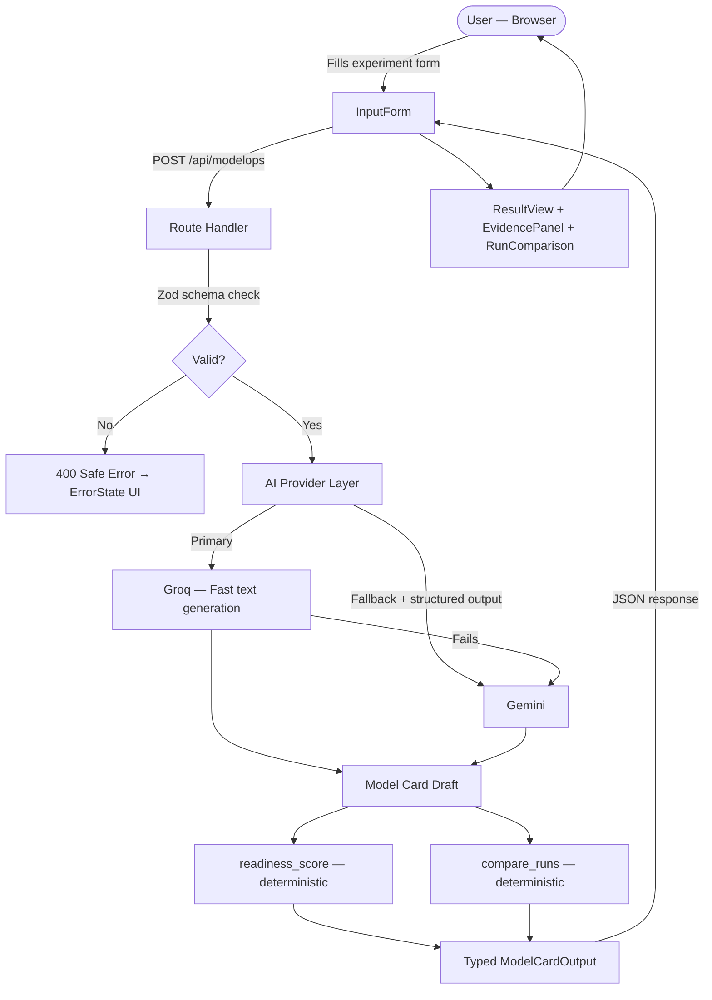

# ModelOps — System Architecture

> **Owner:** Ahmed Amir Rusrus — Integration Lead / Solution Architect
> **Last updated:** Pre-Session 1
> **Status:** Draft — to be agreed by all members before Session 2

---

## 1. What This System Does

A user submits ML experiment metadata. The system validates it, uses AI to draft a model card strictly from that evidence, runs deterministic readiness and comparison checks, and returns a structured result for human review. Nothing is invented. No deployment is auto-approved.

---

## 2. Production Data Flow



---

## 3. Module Ownership


| Module                                            | Owner       | Boundary                                                                             |
| ------------------------------------------------- | ----------- | ------------------------------------------------------------------------------------ |
| Architecture, contracts, integration, deployment  | **Ahmed**   | Everything that connects the parts                                                   |
| API route, validation, AI providers, schema       | **Haneen**  | Server-side only. No secret reaches the client                                       |
| UI pages, form, result render, all UI states      | **Mohamed** | Works against real API contract — not mocks-only                                    |
| Deterministic tools, knowledge corpus, eval cases | **Zein**    | `readiness_score()` and `compare_runs()` are pure functions. No AI logic inside them |

**Dependency order:** Zein → Haneen→ Mohamed → Ahmed → Production

---

## 4. File Structure

```
modelops/
├── src/
│   ├── app/
│   │   ├── page.tsx                        # Root → redirects to /modelops
│   │   ├── modelops/
│   │   │   └── page.tsx                    # Main workflow page [Mohamed]
│   │   └── api/
│   │       └── modelops/
│   │           ├── route.ts                # POST /api/modelops — generate card [Haneen]
│   │           └── compare/
│   │               └── route.ts            # POST /api/modelops/compare [Haneen+ Zein]
│   ├── components/
│   │   ├── modelops/
│   │   │   ├── InputForm.tsx               # Experiment intake [Mohamed]
│   │   │   ├── ResultView.tsx              # Model card render [Mohamed]
│   │   │   ├── EvidencePanel.tsx           # Gaps + sources display [Mohamed]
│   │   │   └── RunComparison.tsx           # Side-by-side runs [Mohamed]
│   │   └── common/
│   │       ├── LoadingState.tsx            # [Mohamed]
│   │       └── ErrorState.tsx              # [Mohamed]
│   └── lib/
│       ├── schemas/
│       │   └── model-card.ts               # ModelCardOutput interface + Zod [Haneen]
│       ├── validators/
│       │   └── experiment.ts               # Input Zod schema [Haneen]
│       ├── providers/
│       │   ├── groq.ts                     # Primary provider [Haneen]
│       │   └── gemini.ts                   # Fallback + structured output [Haneen]
│       ├── tools/
│       │   ├── readiness-score.ts          # Deterministic — no AI [Zein]
│       │   └── compare-runs.ts             # Deterministic — no AI [Zein]
│       └── corpus/
│           └── source-register.ts          # Approved sources [Zein]
├── tests/
│   ├── api/
│   │   └── modelops.test.ts                # API + schema tests [Haneen]
│   ├── tools/
│   │   ├── readiness-score.test.ts         # [Zein]
│   │   └── compare-runs.test.ts            # [Zein]
│   └── e2e/
│       └── workflow.test.ts                # Full journey [Ahmed]
├── docs/
│   ├── architecture.md                     # This file [Ahmed]
│   ├── api-contracts.md                    # Route specs [Ahmed]
│   ├── release-checklist.md               # Final gate [Ahmed]
│   └── ai-usage.md                        # AI usage log [All]
├── .github/
│   ├── pull_request_template.md
│   └── ISSUE_TEMPLATE/
├── .env.example                            # Variable names only — no values
├── vercel.json
└── README.md
```

---

## 5. API Surface (Contracts Frozen in Session 2)


| Route                   | Method | Owner        | What it does                                                       |
| ----------------------- | ------ | ------------ | ------------------------------------------------------------------ |
| `/api/modelops`         | POST   | Haneen       | Validate → AI draft → readiness score → return`ModelCardOutput` |
| `/api/modelops/compare` | POST   | Haneen+ Zein | Deterministic run comparison → return diff result                 |

Full request/response shapes live in `docs/api-contracts.md`.

---

## 6. Shared Output Schema

Every AI response **must** conform to this. `readiness_score` and `decision` are **never** set by the AI.

```typescript
interface ModelCardOutput {
  model_name:      string
  version:         string
  dataset:         string
  metrics:         Record<string, number>
  intended_use:    string
  limitations:     string[]
  risks:           string[]
  tests:           string[]
  reproducibility: string
  readiness_score: number   // set by readiness_score() — deterministic
  decision:        string   // set after human review — never auto-approved
}
```

---

## 7. Provider Strategy


| Priority | Provider   | Role                                    |
| -------- | ---------- | --------------------------------------- |
| 1        | **Groq**   | Primary — fast text generation         |
| 2        | **Gemini** | Fallback + guaranteed structured output |

If both fail → safe error response to client. Error details stay server-side. No provider error message is forwarded to the browser.

---

## 8. Security Rules (Non-Negotiable)

- `GROQ_API_KEY` and `GEMINI_API_KEY` are server-side env vars only
- No secret touches `src/app/` client code or any component
- All input is validated by Zod **before** any provider is called
- Tool arguments (`readiness_score`, `compare_runs`) are validated before execution
- `.env.example` has variable **names only** — committed to repo
- `.env.local` is in `.gitignore` — never committed

---

## 9. Environment Variables

Documented in `.env.example`. Set in Vercel dashboard for production.


| Variable         | Used by                   | Side        |
| ---------------- | ------------------------- | ----------- |
| `GROQ_API_KEY`   | `lib/providers/groq.ts`   | Server only |
| `GEMINI_API_KEY` | `lib/providers/gemini.ts` | Server only |

---

## 10. Extension Points

This architecture is designed to grow without rewiring. Future additions slot in cleanly:


| Future feature                   | Where it slots in                                         |
| -------------------------------- | --------------------------------------------------------- |
| Persist experiment runs          | Add`lib/storage/` — Moamen owns the interface            |
| More AI providers (OpenAI, etc.) | New file under`lib/providers/` — no other files change   |
| Export model card as PDF         | New component under`components/modelops/` — Mohamed owns |
| More deterministic tools         | New file under`lib/tools/` — Zein owns                   |
| Auth / user accounts             | Middleware layer at`src/middleware.ts` — Ahmed owns      |
| CI status checks                 | `.github/workflows/` — Ahmed enables in Session 4        |

---

## 11. Session Gate Checkpoints


| Session | Architecture milestone                                                             |
| ------- | ---------------------------------------------------------------------------------- |
| **1**   | This document agreed by all members                                                |
| **2**   | `docs/api-contracts.md` frozen and signed off — no contract changes without Ahmed |
| **3**   | All modules running on`dev` end-to-end, no mocks in critical path                  |
| **4**   | Production build clean on Vercel, env vars set, rollback documented                |
| **5**   | Every member can explain their module boundary from this document                  |

---

*This document is the source of truth for module boundaries. Any change to a module's public interface requires a PR reviewed by Ahmed before it is merged.*
