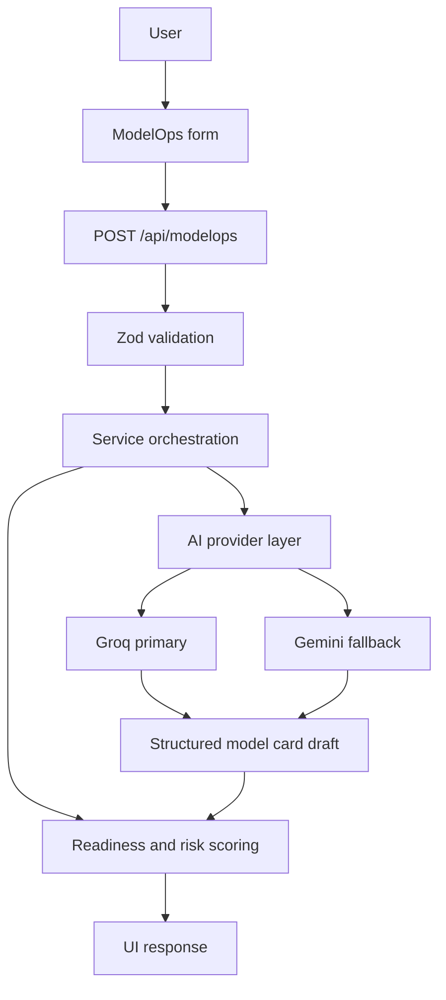

# ModelOps — System Architecture

This document reflects the current implementation in the repository rather than the earlier draft ownership model.

## 1. What the system does

The application accepts experiment metadata, validates it, generates a model card draft with AI when available, computes deterministic readiness and risk outputs, and returns a structured result for UI rendering and human review.

## 2. Runtime flow

## 3. Current module responsibilities

- API routes in [src/app/api/modelops/route.ts](src/app/api/modelops/route.ts) and [src/app/api/modelops/compare/route.ts](src/app/api/modelops/compare/route.ts) handle request validation and response shaping.
- The orchestration layer in [src/lib/modelops/service.ts](src/lib/modelops/service.ts) coordinates prompt generation, AI execution, parsing, caching, and deterministic scoring.
- Provider-specific logic lives in [src/lib/ai/groq.ts](src/lib/ai/groq.ts) and [src/lib/ai/gemini.ts](src/lib/ai/gemini.ts).
- Prompt construction, parser validation, and sanitization live in [src/lib/ai/prompts.ts](src/lib/ai/prompts.ts), [src/lib/ai/validators.ts](src/lib/ai/validators.ts), and [src/lib/modelops/schema.ts](src/lib/modelops/schema.ts).
- Deterministic scoring is implemented in [src/lib/modelops/readiness.ts](src/lib/modelops/readiness.ts) and [src/lib/modelops/risk.ts](src/lib/modelops/risk.ts).
- The UI is rendered by [src/app/modelops/page.tsx](src/app/modelops/page.tsx) and [src/components/modelops/ModelCardDashboard.tsx](src/components/modelops/ModelCardDashboard.tsx).

## 4. API surface

- POST /api/modelops: validate input, generate a model card draft, compute readiness and risk outputs.
- POST /api/modelops/compare: compare two experiment runs deterministically.

The detailed request and response shapes are documented in [docs/api-contracts.md](docs/api-contracts.md).

## 5. Safety and governance rules

- Provider secrets stay server-side and are never sent to the client.
- All input is validated before any provider call.
- AI output is parsed and sanitized before it is passed into the schema.
- Readiness and risk scoring are deterministic and not set by the AI.
- The UI shows a human-review-oriented output, not an auto-approval decision.

## 6. Verification status

The current implementation has been verified through linting, production build, and automated tests.
