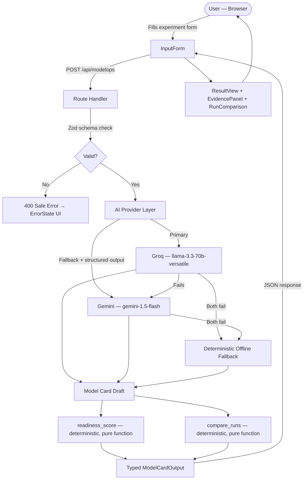

# ModelOps — System Architecture

> **Owner:** Ahmed Amir Rusrus — Integration Lead / Solution Architect
> **Last updated:** Session 1
> **Status:** Active — agreed by all members before Session 2 gate

---

## 1. What This System Does

ModelOps is a lightweight ML governance workspace. A user submits experiment metadata (dataset, model, metrics) and the system:

1. Validates the input server-side before any AI is called
2. Uses AI to draft a model card strictly from the submitted evidence
3. Runs a deterministic readiness check to find gaps and assign a score
4. Compares multiple runs side-by-side with deterministic metric diffs
5. Returns a structured result for human review — never auto-approved

**Non-negotiable rule:** The AI writes *from evidence only*. If evidence is missing, the gap is flagged. Nothing is invented.

---

## 2. Production Data Flow



---

## 3. Module Ownership

| Module | Owner | Boundary |
|--------|-------|----------|
| Architecture, contracts, integration, deployment | **Ahmed Amir Rusrus** | Everything that connects the parts. Reviews all PRs before merge. |
| API route, validation, AI providers, schema, service | **Moamen Elkholy** | Server-side only. No secret reaches the client. |
| UI pages, form, result render, all UI states | **Mohamed Said Mohamed Barakat** | Works against real API contract — not mocks-only in critical path. |
| Deterministic tools, knowledge corpus, eval cases | **Zein ElDin Mohamed Farouk** | `readiness_score()` and `compare_runs()` are pure functions — no AI logic inside them. |

**Dependency order:** Zein → Moamen → Mohamed → Ahmed → Production

**Rule:** Any change to a module's public interface (API shape, tool signature, schema field) requires a PR reviewed by Ahmed before it is merged to `dev`.

---

## 4. Actual File Structure

```
ModelOps-main/
├── src/
│   ├── app/
│   │   ├── page.tsx                        # Root redirect to /modelops
│   │   ├── layout.tsx                      # App shell
│   │   ├── globals.css
│   │   ├── modelops/
│   │   │   └── page.tsx                    # Main workflow page [Mohamed]
│   │   └── api/
│   │       └── modelops/
│   │           ├── route.ts                # POST /api/modelops [Moamen]
│   │           └── compare/
│   │               └── route.ts            # POST /api/modelops/compare [Moamen + Zein]
│   ├── components/
│   │   ├── modelops/
│   │   │   ├── InputForm.tsx               # Experiment intake form [Mohamed]
│   │   │   ├── ResultView.tsx              # Model card render [Mohamed]
│   │   │   ├── EvidencePanel.tsx           # Gaps + sources display [Mohamed]
│   │   │   └── RunComparison.tsx           # Side-by-side run diff [Mohamed]
│   │   └── common/
│   │       ├── LoadingState.tsx            # [Mohamed]
│   │       └── ErrorState.tsx              # [Mohamed]
│   ├── lib/
│   │   ├── ai/
│   │   │   ├── groq.ts                     # Primary provider [Moamen]
│   │   │   ├── gemini.ts                   # Fallback + structured output [Moamen]
│   │   │   ├── prompts.ts                  # Prompt builder — anti-hallucination rules [Moamen]
│   │   │   ├── providers.ts                # Fallback orchestration [Moamen]
│   │   │   └── validators.ts               # AI response parser + Zod enforcement [Moamen]
│   │   ├── modelops/
│   │   │   ├── schema.ts                   # ModelCardOutput Zod schema [Moamen]
│   │   │   ├── service.ts                  # Request orchestrator + LRU cache [Moamen]
│   │   │   ├── validators.ts               # ExperimentMetadata input schema [Moamen]
│   │   │   ├── tools.ts                    # readiness_score() + compare_runs() [Zein]
│   │   │   ├── tool-rules.ts               # Scoring rules documentation [Zein]
│   │   │   ├── taxonomy.ts                 # Domain taxonomy [Zein]
│   │   │   └── lru.ts                      # LRU cache utility [Moamen]
│   │   ├── corpus/                         # Approved knowledge sources [Zein]
│   │   ├── env.ts                          # Server env var validation
│   │   ├── errors.ts                       # Error types
│   │   ├── logger.ts                       # Server-side logger (no secrets)
│   │   └── rate-limit.ts                   # Request rate limiting
│   └── types/
│       └── index.ts                        # Shared TypeScript interfaces [All]
├── tests/
│   ├── api/
│   │   ├── modelops.test.ts                # POST /api/modelops tests [Moamen]
│   │   └── compare.test.ts                 # POST /api/modelops/compare tests [Moamen + Zein]
│   ├── tools/                              # readiness_score() + compare_runs() tests [Zein]
│   ├── e2e/                                # Full journey tests [Ahmed]
│   ├── evaluation/                         # 10-case evaluation matrix [Zein]
│   └── fixtures/                           # Sample experiment records [Zein]
├── docs/
│   ├── architecture.md                     # This file [Ahmed]
│   ├── api-contracts.md                    # Route specs + schemas [Ahmed]
│   ├── release-checklist.md                # Production gate [Ahmed]
│   ├── ai-usage.md                         # AI usage log [All members]
│   ├── source-register.md                  # Approved trusted sources [Zein]
│   ├── model-card-template.md              # Required model card structure [Zein]
│   ├── readiness-checklist.md              # Human-readable scoring rubric [Zein]
│   └── known-gaps-and-limitations.md       # Known quality findings [Zein]
├── .github/
│   ├── pull_request_template.md            # [Ahmed]
│   └── ISSUE_TEMPLATE/                     # Per-role issue templates [Ahmed]
├── .env.example                            # Variable names only — no values [Ahmed]
├── vercel.json                             # Vercel configuration
├── next.config.ts
├── package.json
└── README.md                               # [Ahmed]
```

---

## 5. API Surface

| Route | Method | Owner | Description |
|-------|--------|-------|-------------|
| `/api/modelops` | POST | Moamen | Validate input → AI draft → `readiness_score()` → return `ModelCardOutput` |
| `/api/modelops/compare` | POST | Moamen + Zein | Validate two runs → `compare_runs()` → return deterministic diff |

Full request/response shapes with examples live in `docs/api-contracts.md`.

---

## 6. Shared Output Schema

Every AI response **must** conform to `ModelCardOutput` (defined in `src/lib/modelops/schema.ts`).
`readiness_score` and `decision` are **never** set by the AI.

```typescript
// src/lib/modelops/schema.ts — source of truth
interface ModelCardOutput {
  model_name:           string       // from submitted evidence
  version:              string       // from submitted evidence
  dataset:              string       // from submitted evidence
  experiment_info:      string       // AI-drafted from evidence
  input_shape:          string       // from submitted evidence or "Not specified"
  data_types:           string[]     // from submitted evidence
  distribution_summary: string       // AI-drafted from evidence
  metrics:              Record<string, number>  // from submitted evidence only
  intended_use:         string       // from submitted evidence
  warnings:             string[]     // AI-identified from evidence
  limitations:          string[]     // from submitted evidence + AI gaps
  risks:                string[]     // from submitted evidence + AI gaps
  tests:                string[]     // from submitted evidence
  reproducibility:      string       // from submitted evidence
  ai_analysis:          string       // AI-drafted narrative — evidence only
  detected_issues:      string[]     // AI-identified from evidence
  error_reasons:        string[]     // validation failures
  suggested_fixes:      string[]     // AI-suggested from evidence
  next_steps:           string[]     // AI-suggested from evidence
  references:           string[]     // must appear in docs/source-register.md
  evidence:             string[]     // submitted facts used to justify claims
  readiness_score:      number       // set by readiness_score() — NEVER by AI
  decision:             string       // set after human review — NEVER auto-approved
}
```

---

## 7. Provider Strategy

| Priority | Provider | Model | Role |
|----------|----------|-------|------|
| 1 | **Groq** | `llama-3.3-70b-versatile` | Primary — fast text generation, 30s timeout |
| 2 | **Gemini** | `gemini-1.5-flash` | Fallback — structured JSON output guaranteed |
| 3 | **Offline** | *(none)* | Deterministic card grounded in metadata only |

If both providers fail → service synthesizes a deterministic card from submitted metadata. Safe error response goes to client. Provider error details stay server-side only.

---

## 8. Security Rules — Non-Negotiable

| Rule | Enforcement |
|------|-------------|
| `GROQ_API_KEY` and `GEMINI_API_KEY` are server-side only | Validated in `src/lib/env.ts` |
| No secret touches any `src/app/` or component file | ESLint + code review |
| All input is Zod-validated before any provider is called | `src/lib/modelops/validators.ts` |
| Tool arguments validated before execution | `src/app/api/modelops/compare/route.ts` |
| `.env.example` has variable names only — no values | Committed to repo |
| `.env.local` is git-ignored — never committed | `.gitignore` enforces this |
| Server logs omit secrets and raw tokens | `src/lib/logger.ts` |
| Rate limiting on all API routes | `src/lib/rate-limit.ts` |

---

## 9. Environment Variables

Documented in `.env.example`. Set in Vercel dashboard for production — never in the repository.

| Variable | Used by | Side |
|----------|---------|------|
| `GROQ_API_KEY` | `src/lib/ai/groq.ts` | Server only |
| `GEMINI_API_KEY` | `src/lib/ai/gemini.ts` | Server only |
| `NEXT_PUBLIC_APP_URL` | Build-time config | Public (no secret) |

---

## 10. Session Gate Checkpoints

| Session | Architecture milestone |
|---------|----------------------|
| **1** | This document agreed by all members; repo + branch rules active |
| **2** | `docs/api-contracts.md` frozen — no contract changes without Ahmed sign-off |
| **3** | All modules running on `dev` end-to-end; no mocks in critical request path |
| **4** | Production build clean on Vercel; env vars set in dashboard; rollback documented |
| **5** | Every member can explain their module boundary from this document individually |

---

## 11. Extension Points

Future additions slot in without rewiring existing modules:

| Future feature | Where it slots in |
|----------------|-------------------|
| Persist experiment runs | Add `lib/storage/` — Moamen owns the interface |
| More AI providers (OpenAI, etc.) | New file under `lib/ai/` — no other files change |
| Export model card as PDF | New component under `components/modelops/` — Mohamed owns |
| More deterministic tools | New file under `lib/modelops/` — Zein owns |
| Auth / user accounts | Middleware at `src/middleware.ts` — Ahmed owns |
| CI/CD status checks | `.github/workflows/` — Ahmed enables in Session 4 |

---

*This document is the source of truth for module boundaries. Any change to a module's public interface requires a PR reviewed by Ahmed Amir Rusrus before it is merged.*
